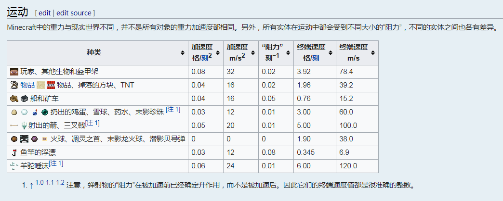

# 绪论

## 研究背景与意义

实体运动看起来很简单，但是真正了解其具体机制的并不多。就连wiki上**\[1\]**对实体运动的专门论述也只有这一点（三叉戟和浮漂还是现补的，如图1-1所示），不严谨甚至还不完全正确，就比如这里玩家的阻力数据只在Y轴上较为准确，其它轴则有很大差距。另外，爆炸、活塞推动等加速方式的具体数据和实体移动过程细节并不普及，网上部分实体运动公式定义不清晰，对实体运动理论的系统论述缺失，这就是我写这篇报告的原因。

> 图1.1WIKI关于实体运动的描述
>

说起来研究过程算是比较困难的，因为网上这方面的现成资料太少了，很多东西不得不自己弄，加上这个涉及面广（实体运算，游戏运算顺序，区块加载甚至网络方面都不少涉及），运算量大（大部分是手算），研究了将近10个月才完成。即使很多内容都经过了反复的研究验证，出现失误还是难免的，希望大家发现了欢迎反馈。

通俗性我已经尽力了，如果还是有看不懂且较为重要的内容大家也可以通知一下，若有修改建议的欢迎大家提出。

## 本文主要研究思路

2020年10月中旬：从TNT炮开始接触实体运动理论

2020年10月下旬：推导出第一套适用于TNT实体的运动公式，但包含sigma且只有求初速度、某gt末位移及Motion的一些基础公式。

2020年11月上旬：成功化简了公式中的求和部分，得出第一套推导过程,不久后引入k值

2020年11月下旬：得出另外五类实体对应的公式，调整定义使其更便于使用，初步研究了Entity类及LivingEntity类，初步研究了一批实体的运算过程。

2020年12月：研究了爆炸机制（可能是正确的，但因为"不合常理"在当时没确定），投掷物的运动，推导出所谓"万能方程"的前身，发现了LivingEntity水平阻力系数与wiki的不一致。

2021年1月：进一步研究了一批实体的运算过程，推导出运动轨迹方程，研究了流体加速机制，尝试研究鞘翅飞行机制。

2021年2月：进一步研究Minecraft源码，编写了一个辅助Mod，初稿开始，研究了实体间的运算顺序。

2021年3月：进一步研究Entity类，重点是`move()`，`pushOutOfBlocks()`和`calculateDimension()`等方法。进一步研究LivingEntity运动机制。研究了另外一些实体的运算过程及服务端运算机制。重新研究爆炸接触率，发现了浮点数误差对爆炸取样点影响的规律，但得出的其他结论有误。发现了箭矢的一些特性。设计出一种射程约在13000m的TNT炮。

2021年4月：研究了一些实体的运算流程，尝试了建立更加普适的定义。

2021年5月：推导出鞘翅飞行、TNT推进相关的一些公式，对raycast初步研究，解决了弹射物矫正问题。

2021年6月：对raycast形成了较为完整的认知，解释了刷沙机原理，重点研究了物品实体及玩家运算。

2021年7月：进一步研究了玩家运算，解释了在实体脚下循环生成TNT相关的问题，大概地研究了矿车的在轨运动机制，进一步研究了船的运动机制，设计出一种可行的珍珠炮方案并搭建。编写了本文的大部分内容，23日发布初稿，而后进行简单的检查及修正。

2021年8月：对TNT归中和珍珠炮相关内容进行了研究，搭建出一个真正有实用价值的珍珠炮，并修正几处相关错误。

2021年9月：对多次弹射的优化问题进行了研究，下旬第一次全面审稿，发现大量错误并修正。

2021年10月：继续检查并修正几十处错误，期间对raycast和36号方块影响范围等内容进行了重新研究，进一步研究了爆炸接触率计算中取样点的偏移，研究了拴绳机制，设计了两个接近平射的珍珠Y轴矫正。

2021年11月：继续检查并修正少量错误，对1.17中新特性进行了一些研究，重新研究了实体挤压。更深入地研究了拴绳机制。

2022年4-10月：对本文进行少量修改

## 本文所需知识基础

(1) Minecraft的基础游戏机制，如怪物会掉落物品，活塞会推动实体等。

(2) Minecraft中一些基础名词，如玩家、方块、实体、生物、粘液块、坐标和爆炸等。

(3) Minecraft中一些专业概念，如区块、游戏刻、服务端和维度等。

(4) 高中必修阶段及以前的数学概念。

(5) 高中必修阶段及以前的物理概念。

## 内容概要

第二节给出一些基本概念，**是阅读下文的基础**

第三节给出用于描述实体在理想运动状态（只受固定加速度和阻力系数阻力作用）下的运动情况的一些常用公式及其应用（包括刻数的判定，以及三个以上运算阶段的实体的处理方法等内容），**强烈建议看完**

第四节描述了Minecraft中存在的两大实体移动（就是坐标和碰撞箱移动的过程）方式，个人认为可以区分就行

第五节说明了一些外部因素对实体的运动的影响，大家可以按需阅读或作为一个参考来用

第六节说明了LivingEntity（玩家生物盔甲架）的运动机制，概述了AI控制速度的基本原理，介绍了状态效果等因素对运动的影响，最后简要说明了鞘翅飞行机制

第七节从创建、运算和影响三方面介绍了十类常见实体的运动特点，也是一个参考。

第八节向大家展示了实体运动的一些实际应用，可以按需阅读。

## 一些特殊约定

该文档主要面向Minecraft Java Edition 1.16.4和1.16.5，部分旧版本、Java Edition 1.17.1和基岩版中的差异也有部分提及，但并不是全部。实际上实体运动机制在同一流派版本间大致还是保持不变的，所以文中的大部分内容应该是可以适用于目前Java版的几乎全部主流版本。

文中涉及的Minecraft截图中判断方向可以参考图中的F3界面下的光标，三条垂直的红、绿、蓝色线段分别标示了X、Y、Z轴的正方向。

所有"水"如不特殊说明均包括含水方块，所有"**水方块**"不包括含水方块。除船以外，"**与流体接触**"相关判断均是以判断发生前最近一次的流体相关运算（调用`updateWaterState()`方法）时的状态为准。

文中的"**Motion大小**"是指Motion各分量的平方和的算术平方根，"**水平Motion大小**"是指Motion的X、Z分量的平方和的算术平方根，“**（水平）Motion为...**”也是表示（水平）Motion大小为某值。类似地，文中的实体间"**距离**"是指两实体坐标差值各分量的平方和的算术平方根，实体间"**水平距离**"是指两实体坐标差值的X、Z分量的平方和的算术平方根。

文中经常会有类似于"将碰撞箱向四周/各方向扩大1m后得到的新区域"的叙述，这种叙述对应源码中的`Box.expand()`方法，具体机制不好通俗说明（要涉及切比雪夫距离）。如图1.5，将红石块所示范围相四周（左）和各方向（右）扩大1m后得到的区域由灰色玻璃标出（包括红石块本身）。

> 图1.5 碰撞箱的扩大
>

若无特殊意义，文中的$t_{0} = 1gt$