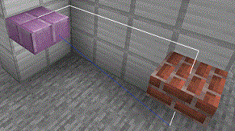
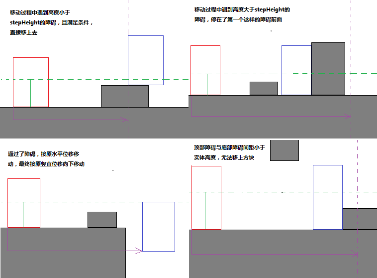
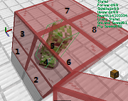
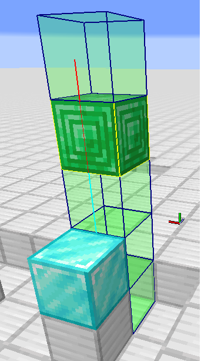
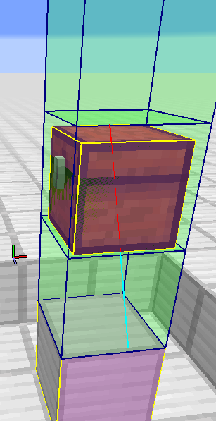
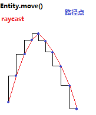

# 实体移动过程及碰撞机制

## 基于Entity.move()方法

首先需要说明，这是几乎所有实体（包括玩家、除恼鬼外大部分生物、盔甲架、交通工具、TNT、物品、落沙、烟花火箭、鱼竿浮标和被活塞及潜影盒推动时的各种实体等）共有的运动形式，通用性极强，所以很重要，有些内容可能不很好懂，但最好还是了解一下。部分实体重写了该方法，如潜影贝重写了该方法使其在被潜影盒推动时尝试传送。

此处输入位移均指作为参数传到`Entity.move()`方法中的位移向量。

研究相关源代码（`net.minecraft.entity.Entity:517`）,可知这种实体移动过程如下，其中2-4步合称"**位移趋势预处理**"，**输入位移**（即作为参数传入该方法的位移，也称**位移趋势**）经预处理得到"**实际位移趋势**"：

1. 若实体的noClip属性为true，直接移动碰撞箱及坐标，跳过其它步骤（518-520）
2. 若移动源为活塞，进行相关调整（在`adjustMovementForPiston()`方法中定义，主要为限制位移和坐标轴）（522-527）
3. 尝试应用蛛网和浆果丛对本次移动的减速作用（529-534）
4. 进行潜行相关调整（在`adjustMovementForSneaking()`方法中进行，默认为不调整，潜行且着地的玩家在处理自身Motion产生的移动时会避免从高度大于stepHeight，即0.6m（客户端）或1m（服务端）的边缘掉落）（536）
5. 对方块，世界边界和固体实体的碰撞检查（`adjustMovementForCollisions()`）（537）
   1. 初步检查（709）
   2. 能直接移上去的方块相关的修正（714-727）
6. 如果剩余的位移趋势大于$10^{-7}$m，移动碰撞箱和坐标（需注意，碰撞箱和坐标无直接关系）（538-541）
7. 更新horizontalCollision（水平碰撞），verticalCollision（垂直碰撞），onGround状态（545-547）
8. 进行摔落相关运算（此处由实体的`fall()`方法定义）默认如下（548-550）
   1. 若已落地且FallDistance\>0,进行摔落伤害运算并置零FallDistance（916）
   2. 否则，增加FallDistance（921）
9. 将X、Z轴中发生碰撞（实际位移未达到实际位移趋势）的轴上Motion归零，1.18.2-Pre1前，若两轴都有碰撞，则恢复X轴上的Motion（552-558）
10. 若发生竖直方向碰撞（顶头或落地）则进行实体着陆方块（见第5节开头）的onEntityLand()方法定义的一个操作（560-567）
    1. 大部分方块（包括空气）默认为置零y轴Motion（`Block.java:374`）
11. 若着地且未潜行，则尝试产生下方方块在实体从上方经过时的效果（调用对应方块的`onSteppedOn()`方法）（565-567）
    1. 默认无操作，其它方块如红石矿石进行了重写（Block.java：335）
12. 行走声音相关（569-597）
13. 检查方块网格碰撞（`checkBlockCollision()`）（600）
14. 下方方块的减速（影响Motion）作用（608-609）
15. 此时若在火或熔岩中，则被引燃（610-619）

现在，这里主要讨论5和13，余下需要讲解的内容将在后文中讲解。



> 图4.1.1碰撞检查中实体移动路径示意图

在5中，游戏首先会生成一个可能的碰撞范围，包括路径附近的方块、世界边界（仅在实体于边境内时）和固体实体（仅包含不直接或间接共同骑乘统一实体的实体）。然后，游戏会尝试进行一次初步的碰撞检查，即检查实体在按沿各轴方向运动时有没有发生碰撞。与实体碰撞箱相交的物体会被排除，这意味着实体在卡到方块和固体实体内部时可以轻松地出来，但不能重新进入。检查一个轴的过程大概可以理解为为：从某一起点A（原坐标或上一个轴的终点）在对应轴上将坐标加上输入位移趋势在该轴上分量的数值得到另一点B，检查实体碰撞箱从A到B运动过程中有无碰撞，若有，将碰撞点作为该轴的终点和下个轴检查的起点，否则将B作为该轴的终点和下个轴检查的起点。

在1.14及以后，沿轴检查时，Y轴总是被最先检查，然后是XZ轴中实际位移趋势绝对较大的轴（若相等，则是X轴），最后是余下的一个轴；1.14之前则总是按YXZ的顺序进行。这一改动会使一些本来具有方向性的设备不再依赖朝向或者直接失效。例如，假设存在一款想沿轴方向发射TNT的TNT炮，但由于只进行了在两侧用几个方块阻挡炮弹点燃时的随机运动的矫正所以推进方向会略微偏离预计的沿轴方向。那么在1.14前，这一推进速度偏差在预计的方向所在轴为Z轴时会因为炮弹首先尝试沿X轴检查碰撞并撞到方块被消除，但所在轴方向为X轴时这一推进速度偏差则一般不会被消除。在1.14之后，由于游戏可以判断出发射方向并先沿这个方向进行碰撞检查，所以这一推进速度偏差无论目标方向在哪个轴上都不会被消除。


> 图4.1.2实体沿轴碰撞检测路径

可以这样理解，虽然一次移动从坐标变化的角度看来是瞬时的，但是这种移动从碰撞判定的角度却完全可以分成三次独立的**沿轴移动**。也就是说，如图4.1.1所示，这种实体移动过程中可以认为实体是沿白线而非蓝色直线运动的，假如选取大小合适的实体，再赋予合适的速度，实体可以在图4.1.2中管道内部（金块标注的部分，实际上应为空气）由下向上穿过管道。



> 图4.1.3实体直接移上方块相关调整示意图

然后，如果实体在移动前着地，或在移动中Y轴唯一向下且发生了竖直方向上的碰撞，游戏会进行实体直接走上方块的相关调整，大概就是在保证不会出现实体走过去高度（顶部Y坐标与实体原坐标的Y坐标的差值）大于stepHeight的障碍和穿过小于实体碰撞体积的洞的现象且水平位移不多于输入位移的情况下尽可能让水平位移更远，并在不使实际Y轴位移多于输入趋势的情况下的让实体尽可能着地。好吧，通俗地完全解释还是比较难的，大家直接按经验来也好，不过还是给出一些例子，图4.1.3中红框和蓝框为移动前后的实体碰撞箱，灰色部分是固体方块，绿色实线标明了实体的stepHeight，绿色虚线标明了实体一次最高能移上的高度，紫色实线标明了实体的实际位移趋势。前三幅都较好理解，第四幅有时可能算是一个Bug，需要注意。理论上，所有实体都可以有这个能力，但大多数实体的stepHeight被设为0从而没有外在表现，未被骑乘或未被控制的猪和未被骑乘或未被控制的赤足兽为0.5，可以迈上或被推上半个方块；客户端玩家和大部分生物则是0.6，可以迈上或被推上部分不完整方块和船；末影人、溺尸、铁傀儡、马类（HorseBase及其子类）、服务端玩家（目的可能是实现被活塞推上方块的机制）、被骑乘且被控制的猪和被骑乘且被控制的赤足兽为1，可以迈上或被推上完整方块。

此处给出直接走上方块这一机制的实现代码以供参考（`Entity.adjustMovementForCollisions()`：675-685）：

````java
if (this.stepHeight > 0.0f && bl4 && (bl || bl3)) {
	Vec3d vec3d4;
	Vec3d vec3d2 = Entity.adjustMovementForCollisions(this, 
			new Vec3d(movement.x, this.stepHeight, movement.z), 
             box, this.world, shapeContext, reusableStream);
	Vec3d vec3d3 = Entity.adjustMovementForCollisions(this, 
             new Vec3d(0.0, this.stepHeight, 0.0), 
             box.stretch(movement.x, 0.0, movement.z), this.world, 
             shapeContext, reusableStream);
    vec3d4 = Entity.adjustMovementForCollisions(this, 
             		new Vec3d(movement.x, 0.0, movement.z), 
             		ox.offset(vec3d3), this.world, shapeContext, reusableStream
             ).add(vec3d3);
	if (vec3d3.y < (double)this.stepHeight 
        	&& Entity.squaredHorizontalLength(vec3d4) > Entity.squaredHorizontalLength(vec3d2)) {
		vec3d2 = vec3d4;
	}
    
	if (Entity.squaredHorizontalLength(vec3d2) > Entity.squaredHorizontalLength(vec3d)) {
		return vec3d2.add(
            	Entity.adjustMovementForCollisions(this, 
                		new Vec3d(0.0, -vec3d2.y + movement.y, 0.0), 
                         box.offset(vec3d2), this.world, shapeContext, 
                         reusableStream));
	}
}
````

脚手架和熔岩有一些特殊机制，这使得它们对不同种类或状态实体可以有不同的碰撞箱。脚手架倒好说，估计大家都试过了。对于熔岩，这一设定使它对赤足兽有了一个0.5m高的碰撞箱，这是为了使赤足兽可以稳定地走在上面。

1.18前，在碰撞运算中，流体会被忽略，这使路径上的流体不会对该实体产生影响，除非在移动结束后实体仍有部分碰撞箱与其相交。1.18及之后，一个raycast被加入到move()方法中用于摔落伤害的计算（这使得move()方法也会加载沿途区块），但变速等影响仍不会发生。

**固体实体**是一类完全阻挡部分实体移动的实体，目前对大多数实体存在固体性的实体主要有船和活的潜影贝。除了它们以外，`isPushable()`方法返回true的实体（包含矿车、船、鹦鹉、未被骑乘的马类、活的不是旁观者而且未处于可攀登方块所在方块网格内的大部分LivingEntity）对矿车和船也是固体的。另外，共同直接或间接地骑乘同一个实体的实体间相互不表现出固体性。



> 图4.1.4Creeper举例图

第13步中，如果与实体的碰撞箱从各方向向内缩0.001m后的区域相交的方块网格所在区块均被加载，实体会尝试调用那些方块网格中的方块定义的`onEntityCollision()`方法，以实现与相交的方块的交互，如气泡柱变速、仙人掌的伤害运算、末地传送门的传送和促使绊线检查是否被触发（只是促使它检查是否被触发，真正触发还需要它的检查范围内，也就是所在方块内部最下方0.15625m内同时存在有效实体碰撞箱）等。这一运算被称为**检查方块网格碰撞**。检查顺序为从西北到东南，从下到上，但多数情况下不必关心。具体实现代码可以参考`Entity.java:835,checkBlockCollision()`。举个例子，图4.1.4中的苦力怕站在这四个铁块的正中央，绿色线框是它的碰撞箱，红色玻璃标记的8个方块网格都与苦力怕的碰撞箱相交，黑色数字标明了对它们进行检查的顺序；铁块所在网格范围在微量缩小后并不与苦力怕相接触，认定为不相交。

检查方块网格碰撞这一操作在1.21.3前后被从基于Entity.move()的移动过程中，并放置在了实体自身的运算流程当中，不在与移动绑定。与此同时，传统意义上的这一过程在这一版本中也被完全重写，虽然在1gt内位移低于0.99999m时，除了“碰撞箱从各方向向内缩0.001m”中的数字应改为$10^{-5}m$以外这一机制似乎没有发生明显的变化，但在牵扯到较高速度的运动时，检查范围却发生了很大的变化。这时，实体移动起止点之间的直线上附近的方块也会被检查，而且检查的线段长度会被限制在16m左右的数量级。确切来说应该是，实体会取上一次被强加载时碰撞箱的西北偏下顶点指向新碰撞箱的这一顶点的一条有向线段，然后在其两端延长其长度的$10^{-7}$倍，并沿该线段进行一次不一定完整的raycast（详见下一节），找到射线与其经过的各个方块网格边界靠近起点位置的交点，钳位使得这些交点到方块网格侧面边缘的距离不超过$10^{-5}m$，最后假设实体碰撞箱从各方向向内缩$10^{-5}m$得到的立方体范围的西北偏下顶点在这些交点处，并检查与这一系列范围相交的方块网格中的方块。过程中，实体只会截取至多16个大致与起点最近的顶点以减少性能开销。

## 基于raycast的弹射物自主移动

这一类移动方法中决定运动的碰撞判定部分主要用于除鱼竿浮标和烟花火箭外的弹射物的自主移动，烟花火箭虽然在决定运动碰撞判定中使用`Entity.move()`方法，但是在确定究竟撞到了什么方块或实体时仍会使用这种碰撞检查过程。

**raycast**是指检查一个点沿一个有向线段移动的过程中是否发生或者发生了怎样的碰撞的过程。在解释Minecraft中的raycast前，要先引入"方块网格"的概念。


> 图4.2.1方块网格示意图

在一个维度中，每个方块坐标对应一个**方块网格**，一个方块网格范围内各点对应方块坐标相等，或者说将各轴坐标向下取整得到同一个点的所有点对应一个方块网格。一个方块网格大小等于一个完整方块，内部只能有一个方块，没有任何点不属于任何一个方块网格，也没有任何点属于多个方块网格。图(4.2.1)中的玻璃方块占据了一个方块网格，方块内部以及标红的面（西面、北面和下面，不计边界）、棱（与西北偏下的顶点直接相邻的棱，不计端点）和西北偏下顶点属于该方块网格，其它面、棱和顶点不属于该方块网格，各轴正方向在图中以F3界面下准星的形式指出。



> 图4.2.2 raycast示意图一



> 图4.2.3 raycast示意图二

在对于方块的raycast的过程中，原线段向两端延长一个微小值（小到可以忽略，即每一端延长总长度的$10^{-7}$倍）后得到的新线段经过的所有方块网格中的方块会被依次检查。

比较严格地来讲，目前版本中，对单个被检查的方块的raycast主要有以下特点：

(1) 如果线段上距起点最近的一千等分点在方块碰撞箱中（与方块网格类似，此处的碰撞箱范围只包括内部、西面、北面、下面、与西北偏下的顶点直接相邻的棱，或西北偏下的顶点，均不计边界与端点），游戏认定发生了碰撞

(2) 将方块碰撞箱分割为若干个轴对齐边界箱，如果一个点沿着线段从起点移向终点的过程中从任意轴对齐边界箱外部通过了任意一个边界箱上任意一个与线段对应的向量分量绝对值大于$10^{-7}m$的轴垂直且在轴上相对于想对面的位置与起点相对于重点的位置相当的面向平行于该面的两个轴的正负方向分别扩大$10^{-7}m$后得到的矩形，游戏认定发生了碰撞。

当然这样讲显然比较难懂，在不计微小偏差且位移不太大的情形下，也可以认为这些特性与下面的规则大致等价：

(1) 线段在方块内部或穿入了由方块分割出的立方体的表面，游戏认定发生了碰撞

(2) 如果线段的起点或终点在方块表面而且其他部分都在方块外部，游戏会认定碰撞没有发生

(3) 如果线段经过且只经过了其表面，只有经过坐标值较小的面、棱或顶点时（类似方块网格），游戏认定发生了碰撞

(4) 如果线段起点终点重合或近似重合，游戏总会认定碰撞没有发生

(5) 如果线段没有经过该方块的任何部分，游戏会认定碰撞没有发生

至于方块碰撞箱的分割，情形比较复杂，而且会有方向性。大致的流程是，将方块分割为尽可能较少的多个正方体体素（立体像素），然后从碰撞箱中坐标值最小（按X、Y、Z的顺序比较）的一个体素开始，合并Z轴正方向上与该体素相邻而连续的若干个体素得到一个最长的条状区域，接着在X轴两个方向上延伸该条状区域得到一个最大的面状区域，最后在Y轴的两个方向上延伸得到的面状区域，得到一个被分割出的轴对齐边界箱并在碰撞箱中去除该区域后开始下一轮。一个结论是，长方形的方块碰撞箱只能分割出一个与原碰撞箱相同的边界箱。

举个例子，图4.2.2中的线段以铁块顶端作为起点，竖直向上擦过钻石块和绿宝石块的表面，到达较起点高3.5m的终点。在这个过程中，线段经过的是钻石块的南面，不属于钻石块所在的方块网格，所以钻石块并不会被纳入检查范围；线段经过了绿宝石块的北面，也就是说经过了绿宝石块所在的方块网格，所以绿宝石会被检查，线段在绿宝石块的下方就被阻挡了。图4.2.3中绿色（棱为蓝色）方框标明了被检查的方块所在网格的轮廓，黄色方框标明了被检查方块的碰撞箱（若有），青色线条是有向线段中未被阻挡的部分，红色线条是有向线段中被阻挡的部分，其分界处便是碰撞点。

再举一例，图中线段仍是从铁块顶面出发，沿一个斜向上的方向擦过箱子表面，最终到达终点。过程中，因为微量伸长后的线段经过了铁块所占据的方块网格，所以铁块会被检查，但由于只有起点经过铁块表面，铁块并不会阻挡有向线段；尽管线段擦过箱子也是南面，但线段明显经过了其所在网格，所以箱子阻挡了线段。图中标注意义同上。

接着来一个相对离谱的，假如一个实体的Y轴Motion为1000m/gt，水平Motion为0，原位置在一个完整方块的中心，那么在碰撞检查中路径上距起点最近的一千等分点在完整方块上方0.5m处，不在碰撞箱内。接着，由于Y轴上Motion沿正方向，碰撞箱上垂直Y轴的面中只有下面会被检查（为了排除穿出碰撞箱的情况），而这一面没有被路径穿过。最终，实体不会被阻挡。

相对于上面说明的，由这一特性造成的一个更明显的问题就是以这种方式移动的实体有时不会被墙、栅栏、栅栏门、打开的潜影盒、short属性为false的活塞头和36号方块超出其所在方块网格的部分（如栅栏的最上方0.5格）所阻挡，除非线段也经过了它们所在的方块网格，这一差别理论上也应该可以应用在弹射物矫正中。

在1.16.1及之前部分弹射物（如投掷物）检查的是方块的Outline Shape（即光标对准时显示的黑框）的碰撞。这会使一些碰撞错误地发生（MC-73884 **\[21\]**），如撞到打开的栅栏门或草；也会使一些碰撞被错误地忽略，如36号方块的碰撞。

在基于raycast的弹射物运动过程中，游戏首先确定一个以原坐标为起点，以原坐标与位移趋势确定的目标位置为终点的有向线段并用它作为路径对方块进行raycast。如果发生碰撞，则将路径截短到碰撞点。然后，游戏会尝试获取路径附近的所有`collides()`方法返回true的实体（例外：区域效果云、闪电束、物品、末影之眼、末影龙的较大轮廓、烈焰人火球、末影龙火球、凋零之首、幻魔者尖牙、经验球、箭矢、投掷物、鱼竿浮漂、带有Marker标签的盔甲架、烟花火箭和羊驼唾沫）的碰撞箱向六个方向各扩大0.3米后的立方体，并对这些长方体进行另一套raycast，与对方块分割出的单个轴对齐碰撞箱的检查方式一致，即通常只有从长方体外部穿入的路径会被阻挡那个，而只在长方体内部的路径和从长方体内部穿出（而非穿入）的路径不会被阻挡。

如果多个实体碰撞箱拥有公共表面且碰撞点就在这一公共表面，理论上最近一次加载到该维度最早的实体会被碰撞。

因为获取待测实体列表时会先筛选出准备从中取出实体的区段（Subchunk），且只有与以移动路径为体对角线且底面平行坐标平面的一个长方体沿各方向扩大$3 + \frac{弹射物碰撞箱宽度}{2}$的区段会被选中，所以如果实体足够大（高度或宽度的一半大于$3 + \frac{弹射物碰撞箱宽度}{2}$），就会有一部分区域的碰撞被错误地忽略。但是在生存模式中几乎不需要考虑该问题，因为只有恶魂的碰撞箱大小达到了标准且可以与弹射物发生碰撞，而且只有在位置恰到好处，也就是高度接近坐标所在区段的上界时才会造成很少一部分碰撞的丢失。

总的来说，可以这样理解，一次移动中方块碰撞是检查该实体坐标点的直线(而非Entity.move()中沿轴的折线)运动轨迹上有没有方块阻挡，若有，在碰撞点处截短轨迹；实体碰撞则是检查一个以坐标为中心0.6\*0.6\*0.6的立方体在轨迹上是否发生了碰撞，若有，在碰撞点处截短轨迹。

如果多次移动的轨迹共线且期间路径附近的方块和实体没有发生改动，这几次移动与其合并后的一次移动大致是等价的。

需要注意，有些实体即使`collides()`方法返回true也不能与该弹射物发生碰撞，如投掷物，羊驼唾沫，烟花火箭还要求以下条件（`ProjectileEntity. method_26958`）：

(1) 离开发射者，即第一次碰撞箱不与发射者接触且以碰撞箱附近没有与发射者直接或间接地骑乘同一个实体的实体的碰撞箱之后，详见`ProjectileEntity.method_26961()`。

(2) 目标实体不是旁观者，也没有死亡或被移除

(3) 目标实体与发射者不共用一个最底层骑乘实体

1、3满足一个即可，2必须满足。

也有一些类重写了该方法，在上述三类弹射物的基础上增加或是放宽了一些限制。`PersistentProjectileEntity`（箭矢三叉戟）的版本在原来的基础上使其不能在落地前第二次击中某一实体（想一下穿透附魔）；火球凋零头和潜影贝导弹的版本在原来的基础上使noClip属性为true的实体(如带有NoGravity标签的盔甲架)被忽略；钓鱼竿浮漂则不仅是原条件情况下可与实体碰撞，物品实体即使`collides()`方法返回false也是可以的。

至于线与立方体的碰撞检查实现，可以这样说，游戏首先会检查该线与该立方体朝向起点的三个面所在平面的交点，然后检查该交点是否在该面的范围内（边上及与边上距离可以忽略的也算），如果是，那么这个点是有效点。最后游戏会在有效点中选取离起点最近的作为碰撞点，若没有，则判定没有碰撞（`Box.java:244`）。

同样，这里的方块碰撞检查也是忽略流体的，结果同上。另外，我们还发现这里没有对世界边境进行检查，这就可以解释投珍珠穿越边境的操作了。

要知道，上面研究的方法主要是弹射物的共有部分，即碰撞判定，完整的移动部分是各种实体各自实现的，还需要结合其运算流程研究，详见7.7-7.9。

## 两种移动过程的对比



> 图4.3两种移动在碰撞检查角度下的路径点曲线

个人认为，两种移动方式有以下几点主要差别：

(1) Entity.move()方法在碰撞判定中检查的是实体碰撞箱的碰撞情况，实体中只检查固体实体；基于raycast的弹射物自主移动对方块是检查的坐标点的碰撞情况，对符合条件的实体是检查的一个另类的"碰撞箱"的碰撞情况。

(2) Entity.move()方法在碰撞判定中检查的是实体按沿轴折线移动碰撞情况，而基于raycast的弹射物自主移动对方块是检查的是直线轨迹上的碰撞情况。

(3) Entity.move()方法会导致X、Z轴中发生碰撞的轴上Motion的归零，Y轴上发生碰撞时通常也会导致其Motion分量的归零，但基于raycast的默认并不会，具体处理取决于实体类型。

(4) Entity.move()方法会正确地处理碰撞箱超出其所在方块网格的方块，如墙和栅栏，但基于raycast的有时并不能检查到超出部分的碰撞。

(5) Entity.move()方法会触发下方方块的一些效果，如红石矿石发光，但基于raycast的默认并不会。

(6) Entity.move()方法会使onGround（着地）状态更新，但基于raycast的并不会。

(7) Entity.move()方法中实体总会检查方块网格碰撞，但在1.16.1以前，一部分弹射物（已确认有投掷物，不包括使用move()方法移动的和箭矢）自主运动时并不会进行这些处理。

(8) Entity.move()不能检查到未加载区块中的碰撞，除非某次移动绝对沿轴，但基于raycast的总是可以。

无论哪种移动过程都对TPS不敏感，所以单纯的服务端卡顿不会导致碰撞检测发生错误，所以除了高PING或开有外挂的玩家外，应该没有"卡穿墙了"这一说。实际上，即使在客户端取消掉玩家的碰撞判定，在玩家速度不够快时仍不能穿墙。

另外，碰撞检查过程中一般不会发生导致实体卡到墙里或错误地发生碰撞的浮点数误差，因为方块的碰撞箱边界坐标都在浮点数集内。即使产生了浮点数误差，在1.13之后碰撞判定中也有一定的容错机制，确切地说来容错极限是$10^{-7}$m，已经足够了。所以一般来说，碰撞检查应该还是比较靠谱的。

