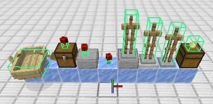
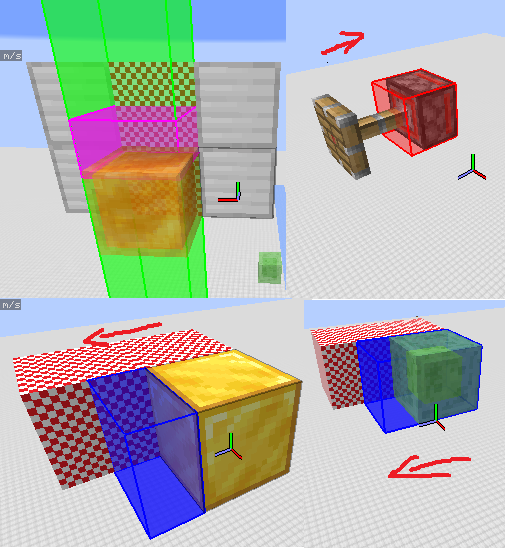
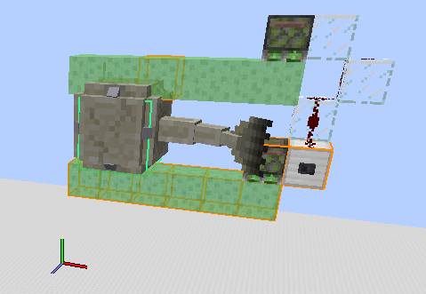
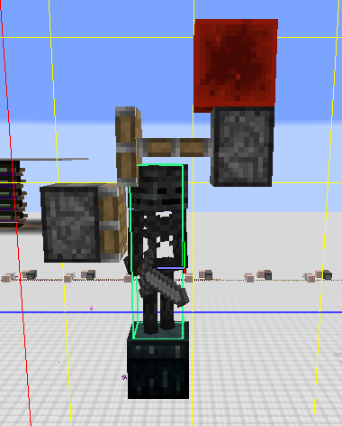
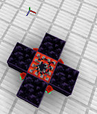
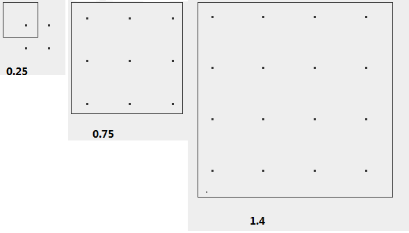
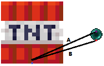

# 外界因素对运动的影响

在开始说明前需要先解释一下：

**实体所处方块**是指实体的实体`blockPos`字段（即实体坐标处的方块坐标）指定位置的方块。

**实体下方方块**是指实体坐标下方略大于0.5格对应方块坐标处的方块。

**实体着陆方块**一般指实体坐标下方略大于0.2格对应方块坐标处的方块，如果上述标准对应方块为空气且下方是栅栏、墙或栅栏门，则以后者为准。

## 蛛网和浆果丛的减速作用

这一类减速的基础是Entity类中的`movementMultiplier`字段。**`movementMultiplier`**是一个三维向量，在其有效时，基于move()方法的移动中的的输入位移趋势各轴分量会在碰撞检测前被乘以`movementMultiplier`中对应轴上分量的值，并将Motion置为0，`movementMultiplier`置为无效值。它在`Entity.move()`方法的第13阶段更新。

我们可以发现，`movementMultiplier`只在实体被创建时和`slowMovement()`方法被调用时赋值。前一种情况下，取值必定为无效值；后一种情况下也只有两个值可取，分别是浆果丛(0.8,0.75,0.8)和蛛网的(0.25,0.05,0.25)。需注意，赋值是在检查方块网格碰撞时进行的，意味着只有当实体在上次移动后有一部分碰撞箱位于那两种方块所处的微量缩小后的方块网格内且该实体有相关检查（即调用了方块的`onEntityCollision()`方法），下次进行基于Entity.move()的移动时才会受到那两种方块的减速作用。所以，除烟花火箭和鱼竿浮标外的弹射物在一般情况下不会受到这种减速方式的影响。

蜘蛛有一个特判，使得它不会受到蛛网的减速。

创造模式和旁观模式飞行中的玩家不会受到这类减速作用的影响。

## 粘液块和床的回弹

`Block.onEntityLand()`方法的行为默认是将该实体y轴Motion设为0，粘液块和床对其进行了重写以实现其弹起实体的效果。需要注意，由于该方法只会被`Entity.move()`调用，大部分弹射物自主运动时不会以此方式被影响。不过，理论上，如果能以某种方式调用弹射物的`move()`方法（如活塞或潜影贝推动），对弹射物仍是可以造成影响的。某些实体有一些在移动后判断是否着地，如果着地继续反转速度的机制，目的就是禁用弹起，详见第7节。

在实体y轴Motion小于0且实体未潜行时，粘液块会将LivingEntity的y轴Motion直接反转，或将非LivingEntity实体的y轴Motion乘以0.8之后反转（`SlimeBlock.java：33,bounce()`）需要注意，这里的反转不是相对上一刻的反转，而是相对调用方法时，因为从上一刻到现在Motion已经做了一些其它修改（如重力）。

床的反弹原理与粘液块相似，只是在粘液块的基础上将回弹后y轴Motion再乘上0.66而已。

## 蜂蜜块和灵魂沙的减速作用

这一类变速是在基于Entity.move()方法的实体移动的第14阶段中进行的，原理是在实体所在方块坐标处不为水方块、气泡柱或`velocityMultiplier`不为1的方块时将实体水平两轴上Motion乘以其下方方块定义的`velocityMultiplier`，否则乘以所在方块定义的`velocityMultiplier`。

目前只有蜂蜜块和灵魂沙定义了该值为0.4，其余全为1。在LivingEntity拥有灵魂疾行附魔时，灵魂沙的`velocityMultiplier`对该实体来说为1。对于各种飞行状态（包括鞘翅飞行）下的玩家，`velocityMultiplier`总为1。

抛开实现原理不论它也与下面滑度不同，因为它在实体未着地时也有效。

该值仍是只在Entity.move()方法中被使用，从而无法影响大部分弹射物的自主运动。

## 滑度机制

**滑度**，说简单了，就是描述一个方块有多滑的一个值，值越大说明方块越滑，等于1时意味着方块绝对光滑。一个方块上方实体若满足一定条件，Motion会在每刻额外乘以该方块的滑度值。

只有着地（onGround为true）的船、掉落物、经验球和着地且不在流体中的LivingEntity会受到滑度影响。着地的TNT和矿车也有类似于受到固定（分别为0.7和0.5）滑度作用的行为，但实际上与此并没有任何关系，详见第七节。

目前原版滑度只有四个不同值，0.6、0.98、0.989和0.8，分别归属于普通方块、冰类、蓝冰和粘液块。

对于大部分LivingEntity，滑度总是以其坐标下方略多于0.5格对应的方块坐标处的方块为准；掉落物、经验球、恶魂和幻翼是以其坐标下方1格对应的方块坐标处的方块为准；船则是以直接支撑它的所有方块的滑度的平均数为准，且其在地面上时水平轴上阻力全部取决于此。图中所有实体得到的滑度都为0.989（蓝冰）。

> 图5.4滑度示意图
>

对于组成有周期性的地面，可以用一个平均滑度近似地计算加速度一定时的最终速度和无加速度时的最终位移等数据。平均滑度可能是每周期参与滑度计算的所有方块滑度的几何平均数。不过，照窃梦者的研究**\[5\]**船的平均滑度应该是每周期参与滑度计算的所有方块滑度的算术平均数，目前不好确定哪个更接近实际。

另外，滑度相关的运算不是在`move()`方法中进行的。对于LivingEntity，其运算位于`travel()`方法中，移动执行前；对于掉落物和经验球，其运算位于`tick()`中，移动执行后；对于船，其运算位于`method_7458()`中，最终在`tick()`中移动前进行。这可能造成取到滑度的位置与实际作用滑度的位置不同，需要了解。

## 气泡柱的变速作用

在检查方块网格碰撞时，如果一个除烟花火箭外的可通过指定Motion标签自主移动的实体微量缩小后的碰撞箱有一部分在气泡柱所在的方块网格中，该实体就会被气泡柱改变Motion，或者说被推动。

在气泡柱上方为空气方块时，每个向上的气泡柱会把实体的y轴Motion设为1.8和处理前Motion+0.1中较小值，向下的气泡柱会把实体的y轴Motion设为-0.9和处理前Motion - 0.03中较大值。在气泡柱上方不为空气方块时，每个向上的气泡柱会把实体的y轴Motion设为0.7和处理前Motion + 0.06中较小值，向下的气泡柱会把实体的y轴Motion设为-0.3和处理前Motion - 0.03中较大值。也就是说，气泡柱中的实体在一定的Y轴Motion范围内受到的加速度是恒定的，否则速度会被限制到一个最值。

在气泡柱上方为空气方块时，其上方的船只有在连续与气泡柱接触60刻（无卡顿的3秒）后才会进行真正的变速，且处理上方直接是空气方块的气泡柱的机制略有不同，详见7.4。

这种变速有累加作用，不涉及反向气泡柱的情况下，参与的气泡柱越多，1gt内检查方块网格碰撞次数越多（尽管通常只有至多一次），变速越快。具体些，每个气泡柱方块都会把第二段中提到的过程重复一遍，顺序可以参考4.1节中方块网格碰撞相关说明。

## 粘液块的减速作用

在基于Entity.move()方法的移动过程的第11步中，如果实体未潜行且已经着地，实体的着陆方块指定的`onSteppedOn()`方法会被调用。粘液块是唯一使用这种方式直接影响实体的运动的方块，在实体经过其上方（即调用其`onSteppedOn()`方法）且实体的Y轴Motion绝对值小于0.1时，它会将该实体的X、Z轴上Motion等比变为原来$0.4+0.2M_{Y}$倍，其中$M_{Y}$为实体的Y轴Motion以m/gt为单位的数值。减速后与减速前速度的比值应在区间\[0.4,0.42)之间，即实体受到一个的阻力系数以$gt^{-1}$为单位的数值在区间(0.58,0.6\]的地面阻力。这一范围已经算是较小的了，加上实体的y轴Motion趋于稳定或以较短（2-4gt）周期变化，最终的速度一般而言是接近稳定的。

## 流体的变速作用

这种变速是在方法`Entity. updateWaterState()`方法中发生的。除水生生物、创造飞行中的玩家、部分不进行实体基础运算的实体和直接骑乘船的实体外，几乎所有实体都会进行流体相关的变速运算。

首先，游戏会检查实体碰撞箱向内缩小0.001m后得到的区域中所有区块是否已经被加载（确切来说，至少为边界加载），如果有任一区块不符合要求，整个过程会被终止。

然后，游戏会取实体碰撞箱向内缩小0.001m后得到的区域中所有方块网格中的**流体流向向量**并对它们做加权平均。流程大致如下：

1. 取h=0，向量**v**=**0**；
2. 依次检查范围内的流体，东边晚于西边，南边晚于北边，上边晚于下边。
   1. 取实体浸入该处流体的深度d，即流体顶部高度减去检查范围中Y坐标下限
   2. 若d≥0,认为该处流体有效
   3. 将h设为d与原有h中的较大值
   4. 在流体有效的前提下，若h\<0.4，将该处流体流速向量与h的积加到**v**中，否则将该处流体流速向量直接加到**v**中
3. 将**v**除以有效流体的个数
4. 如果影响的实体不是玩家实体，将**v**缩放使其大小为1

一个流体的流向向量由其附近的同类流体的与该流体的高度差及该流体的falling状态决定，某水平方向上高度差越大，该方向上分量就越大，模恒为1，除非不流动（四周没有同类流体或四周同类流体等级相等）。如果一个流体有为true的falling状态，它的流向向量向下的分量应远大于（大约8倍）水平方向的分量。获取一个流体流速向量的具体代码如下在`FlowableFluid.getVelocity()`方法中。实际上，平面的情况下最简单的确定一格流体的流向向量的方法就是看这格流体纹理的流动动画，因为在不涉及向下的水流时流体的流动动画与其流向向量是完全同向的。另外附录中提到的MCWMEM也提供了流体流向向量的显示。

最后，游戏会将平均向量乘以给定的合加速度大小加到Motion上。这一合加速度大小在水中为0.014$m/gt^{2}$，在下界的熔岩中为0.007$m/gt^{2}$，在其它维度的熔岩中约为0.002333333$m/gt^{2}$。

## 活塞的推动和变速作用

除旁观者、所有没有碰撞箱的实体、区域效果云、标记实体和带有Marker标签的盔甲架外，所有实体均能被活塞的推动影响，你甚至可以推动幻魔者召唤的尖牙，如果足够及时你甚至可以把它通过传送门推到另一维度。

在活塞伸出或缩回时，它会为对每一个被移动的方块（包括活塞头）创建一个id为moving_piston的方块（又称36号方块、B36）和对应的方块实体。B36不保留被推动的方块的滑度等属性，大部分属性与石头类似。

在每一个方块实体的运算过程中（TE阶段，在实体运算后，可以参考Fallen_Breath的MC运算流程图**\[2\]**），该方块实体会尝试对一定范围内的实体进行一系列移动及变速操作。可以总结出如下的流程：

(1) 第1gt的BE（方块事件处理）阶段，活塞开始移动，被移动的方块对应的B36被创建，此时其progress（进度）属性值为0.0,碰撞箱范围与原碰撞箱一致。

(2) 第1gt的TE（方块实体运算）阶段，各B36方块实体被运算，开始运算时progress值为0.0，碰撞箱范围向移动方向移动了0.0m。该方块实体的运算即将结束时，碰撞箱会向前移动0.5m。

(3) 第2gt的TE阶段，各B36方块实体被运算，开始运算时progress值为0.5，碰撞箱范围向移动方向移动了0.5m。

(4) 第3gt的TE阶段，各B36方块实体被运算，但不影响实体，运算后方块到位，各B36本身被移除。该方块实体的运算即将结束时，碰撞箱会向前继续移动0.5m，到达最终位置。

任何有效且运算次数不满两次的moving_piston方块实体在每gt都会尝试将与其目前的碰撞箱在运算结束时即将新扫过的范围相交（不计边缘）的实体沿移动方向移动至距其新的碰撞箱前方0.01m处。0.01m的额外位移与被移动的方块数量和推动的刻数无关。活塞在直接移动实体过程中实体的Motion不变。在这里每个B36产生的最大位移趋势不超过0.51m。如果实体卡在了一个形状比较奇葩的方块中（如楼梯和炼药锅），该方块的B36对该实体的移动过程将非常复杂，大概是需要把碰撞箱拆成几个立方体（不是逐像素），并把每一个立方体单独作为一个方块计算位移大小，比较具体的过程的叙述可以在4.2节中找到。

粘液块的moving_piston方块实体会将与其目前的碰撞箱范围或下一gt碰撞箱范围相交（不计边缘）的实体沿移动方向的轴上的Motion**直接设为**大小为1m/gt，与移动方向同向的一个值，其它轴不变。这意味着如果一个实体某轴上速度大于1m/gt，同向弹射甚至会使其减速。虽然TNT、经验球和下落的方块在自己的运算中落到地面不会被弹起，但是被活塞推动的粘液块仍可以给它们加速，这是由于粘液块弹射是不排除这些实体的。实际上，给末影水晶等根本无法自主移动的实体增加Motion甚至也是可以的，只是没什么用处罢了。这一类利用"实体撞方块"和"方块撞实体"的区别的情况在活塞推动中的应用是比较普遍的，最常见的两个例子就是盾构机和珍珠矫正。

收回的活塞头的moving_piston方块实体在每gt会尝试将即将被卡到活塞底座与活塞头中间的缝隙中且受到了该B36的直接推动或位于活塞底座内部且受到了该B36的直接推动的实体沿与活塞收回方向相反的方向移动到距活塞方块网格0.02m处。在每gt中的推动进行后，实体会被额外多推动0.02m，所以在收回过程结束后，若不计实体自主移动，实体碰撞箱边缘正常情况下应距离活塞0.02m。这一过程中实体的Motion不变。在这里每个B36产生的最大位移趋势不超过0.51m。

> 图5.8.1 蜂蜜块粘动示意图

水平移动的蜂蜜块的moving_piston方块实体在水平移动时会将其上方的着地的实体沿移动方向移动。准确些，在蜜块上面放块半砖，在蜜块顶部与一个比半砖顶部略高的位置之间我们取一个长方体，则所有与该长方体范围相交（不计边界）且坐标点在某一水平面上的正投影在该长方体在同一水平面上的正投影内部或边界上的实体如果着地就会被移动。或者说，如图5.8.2，如果实体碰撞箱与紫色区域相交且坐标点位于绿色区域内部，实体才可能会被影响。这意味着，除直接站在被移动的蜜块上的实体外，站在蜜块内部且在顶部露出了一部分碰撞箱的实体和站在蜜块上方的不高于0.5m的方块上的实体也会被移动（如图5.8.1中的两个盔甲架在活塞收回时都会被移动）。每个实体在该方块实体被运算时会被推动0.5m，注意没有前两种中的额外的0.01m的推动。这一过程中实体的Motion不变。

> 图5.8.2 B36的影响范围示意图

单个B36的运算中，上述四种影响的产生顺序为：粘液块弹射、一般推动、活塞头挤压和蜜块粘动。

在分析活塞推动过程时，一般不能只找准一个B36去分析（还真被这个坑过），还得分析临近的B36的影响，这就牵扯出来一个方块实体运算顺序的问题，这在不卸载区块时和活塞更新顺序完全相同。

因为活塞直接造成（不包括粘液块的弹射）的所有移动都是基于Entity.move()方法的移动，所以这些移动都有能被蛛网削减，进行的是对碰撞箱的碰撞检查，在水平轴上发生碰撞时发生碰撞的轴上速度会被置零等基于Entity.move()的移动的共性，除非实体的noClip属性为true。

活塞造成的总位移趋势会在`move()`方法中受到限制，所以无论如何，每个坐标轴上每gt由活塞推动造成的相互抵消后的位移绝对值不会大于0.51m。在1.11及之前的版本中是没有这一机制的，意味着如果被活塞推动的实体再某次推动后如果被推到同一gt中下一个被运算的B36的推动范围内，这个实体在1gt内就会被移动两次。如此循环，可以构造一个推动实体的活塞长链，理论上可以将实体在1gt内移动到无限远的地方，但是因为一个与实体管理相关的Bug实际上每gt最多只能移动16m**\[6\]**。最晚在1.12，由于这一机制的加入，这种推动装置失效。

在某些旧版本中，尤其是1.9.4之前，活塞的推动机制存在一些很严重的Bug，如碰撞箱出现部分缺失、合并以及等栅栏断开连接等**\[6\]**。在1.15及以前版本，活塞在收回的最后一gt还会在活塞底座后面露出来一段（4px，0.25m长）活塞臂，导致后面的实体被那一部分推动（不过我认为这不一定算是一个Bug，说实体是被震动的也不是不行）。目前，虽然大部分Bug已经修复，现在B36的碰撞箱的有些行为还是比较奇怪的：

伸出的活塞头B36的碰撞箱会在它后面自带一个本来应该有的无头活塞的碰撞箱，无论这个活塞底座是否真正存在。乍一想非常奇怪，但这是很正常的，因为这时原来的活塞底座已经被B36覆盖，没有这个碰撞箱倒会出现很多Bug。这个多出的碰撞箱不影响推动位移的计算。

在实体被活塞直接移动期间，如果B36的移动方向和实体移动方向一致且progress不为1（第2次运算完毕前），B36的碰撞箱会被忽略，除非它是伸出的活塞头的B36，这时它自带的无头活塞碰撞箱会被保留，活塞头本身对应碰撞箱会被忽略。如图5.8.3，放置两排水平的粘液块，间隔两格，并在下方一列粘液块上方生成一只远古守卫者（高度为1.9975m），最后同时激活两个活塞，守卫者会穿过下方一列粘液块被下弹。过程中，远古守卫者被上方粘液块在直接向下推动时没有检测同为下推的下方粘液块B36的碰撞，从而被推到下方一列粘液块B36碰撞箱内部，进而在以后的移动中不再对其进行碰撞检查并直接穿过它们。

给定一个B36影响范围，与影响范围扩大两格后的范围相交的区段内的实体才会被影响，原因在2.5节中已经进行了说明。如图5.8.3中的凋零骷髅，如果将它放在y=31处的一个箱子正上方，则在y=34处的活塞将不能正确地推动凋零骷髅，尽管推动过程中凋零骷髅的碰撞箱会与B36的碰撞箱相交。

 

> 图5.8.3 活塞推动的两个特性演示
>

最后补充一下，0tick瞬推不能移动或弹射实体，因为活塞对实体的影响依赖于B36方块实体的运算，但是B36方块实体在脉冲撤销时会被提前移除。但是，瞬推可能也伴随着收回过程，这时B36是可能对实体造成影响的。例如，虽然0tick活塞不能推动实体，但在一个推动和收回周期后实体会因为活塞头的收回移至活塞头前方0.02m处。如果活塞收到的脉冲持续时间为1gt，实体可以被粘液块弹射，但移动不会完整地进行。

## 潜影盒和潜影贝的推动作用

被潜影盒和潜影贝推动与被被活塞推动的石头推动非常相似，主要的差别有：

(1) 到位比活塞慢得多（活塞为2gt，而潜影盒潜影贝为10gt）；

(2) 到位后"盒盖"的位移为0.5m而不是1m；

(3) 原碰撞箱内部的实体总是会被移动；

(4) 在一刻内推动某个实体的位移不受限。

另外潜影贝的推动会忽略其他潜影贝和noClip为true的实体。

## 实体挤压（推动）

在你尝试穿过一群动物时，虽然不会发生那种撞到方块时发生的实打实的碰撞，但穿过的过程却还是比较困难；当你想让一个村民坐到船上时，你通常会选择把它挤过去：这就是**实体挤压**。

对于LivingEntity，实体挤压发生在运算接近末尾处，`travel()`方法执行后；对于矿车和船，实体挤压也是发生在运算接近末尾处。

通常，在服务端一个LivingEntity运算过程中与另一个LivingEntity发生实体挤压需要满足以下条件：

(1) 两方碰撞箱相交（不含边界，且要考虑2.5节中提到的Bug）；

(2) 两方都不为盔甲架、蝙蝠或旁观者玩家；

(3) 两方的noClip都不为true；

(4) 两方没有直接或间接地骑乘同一实体；

(5) 被推动的一方未睡眠；

(6) 被推动一方都没有死亡；

(7) 被推动一方坐标所在方块坐标处方块不为可攀登方块（见6.1）；

(8) 队伍设置允许碰撞（原版生存可忽略）。

其中，前4条和第8条如未被满足，实体挤压不会发生，其余条件若不满足，实体挤压仍然可能发生，但挤压只能在双方中的一方的运算中进行，变速幅度相对较小。

上面**虽然有“被推动”这一说法，但实际上实体挤压通常是一个相互作用**，如一个实体A会在其运算时对另一个实体B进行实体挤压，反过来B也会在其运算过程中挤压实体A。所以此处的**主动一方应被理解为实体挤压过程中正在运算的实体，其余被影响的实体是“被推动”的**。

对于Living和船，在满足条件后，游戏会取得两个实体在X、Z轴上坐标差的绝对值中较大值作为一个另类的"距离"（其实就是水平方向上的切比雪夫距离），以m为单位时数值记作d，实体坐标间距离为r，那么这次挤压对双方造成的Motion改变量（冲量）以m/gt为单位的数值$a_{XZ}$满足：

$$\begin{matrix}
a_{XZ} = \left\{ \begin{matrix}
0,d \leq 0.01 \\
\frac{0.05r}{\sqrt{d}},0.01 < d \leq 1 \\
\frac{0.05r}{d},d > 1 \\
\end{matrix} \right.
\tag{5.10.1}
\end{matrix}$$

也就是说，在两个实体间距离过近（没有一轴大于0.01m）时这两个实体不相互挤压，然后在0.01≤d≤1时，加速度随距离递增，最大能达到$0.05\sqrt{2}\ m/{gt}^{2}$，再然后d\>1时加速度在实体坐标间连线方向不变时不变，具体大小与连线方向有关，沿轴方向时最小，对角线方向最大。注意要保证两碰撞箱相交（船和矿车有0.2m的范围延伸）。

实体挤压造成的加速度的方向只与实体坐标间连线的水平投影方向有关，或者说只与实体间的相对位置有关，总是沿该连线水平投影向两端加速，与实体速度，朝向等因素是无直接关系的。实体挤压不影响Y轴Motion，也就是说从实体上面踩下去不会受到实体挤压的阻挡。

Entity类中定义了`pushSpeedReduction`字段，大概是用于表示实体在对实体挤压造成的变速的抗性大小，或者说被削减加速与总加速度的比值，目前似乎未被使用。

如果实体被骑乘，那么该实体不会在实体挤压过程中变速，除非该实体为矿车。

这一加速度在堆积的实体足够多的情况下大小可与爆炸加速匹敌（理论上接近无限），可以使生物瞬间获得极大的速度，这足以使玩家跳跃到数百米外**\[7\]**。若与弱加载技术相结合，我们甚至可以设计利用实体挤压推进的边境炮**\[29\]**。

船的挤压与LivingEntity相似，但也有几处差异：

(1) 被推动实体没有骑乘冷却；

(2) 船的上表面中心下方$\frac{1}{9}$m处没有浸没于水中；

(3) 如果被挤压实体为船且主动挤压实体不为LivingEntity，则船的下表面应低于船的上表面（不含接触），否则，船的下表面应不低于实体的下表面。

其中前两条在源码中隐藏得相对较深，是在制作边境炮时偶然发现的，疑似为一个Bug。成因是实体被初步判定误判为可骑乘到船上而不进行实体挤压，而后来的运算中骑乘请求被拒绝，这使得船存在这样一个不会对应被影响到的实体产生影响的状态。

另外因为船有那种实打实的碰撞，挤压一般只能发生1-2gt，而且在普通方块上时阻力较大，所以通常情况下造成的冲量很小。但是，如果使用弱加载蓄力，这种加速作用仍不可小觑，而且在边境炮中会有较大的利用价值。

矿车的推动与LivingEntity略有不同，实体坐标间距离为r，那么这次推动对矿车一方造成的加速度以$m/{gt}^{2}$为单位的数值$a_{XZ}$满足：

$$\begin{matrix}
a_{XZ} = \left\{ \begin{matrix}
0,r \leq 0.01 \\
0.05,0.01 < r \leq 1 \\
\frac{0.05}{r},r > 1 \\
\end{matrix} \right.
\tag{5.10.2}
\end{matrix}$$

也就是说，矿车挤压造成的加速度大小与方向无关。另外，这一挤压过程中非矿车实体的变速大小为矿车的1/4。

与船类似，矿车依然会要求被推动实体没有骑乘冷却。

大量实体（500个以上）在挤压时会有一部分实体朝几个方向被发射出去，并在几条直线上排列，排列所在直线似乎与实体的创建顺序有关，而且实体创建时间越早弹出距离越大，目前还个人没有较好的解释。

## 骑乘

骑乘一般来说是一个实体附着在另一实体上的状态。一个实体只能骑乘一个实体，但一般可以被多个实体骑乘。需要了解，鹦鹉附着在玩家肩膀上并不属于严格意义上的骑乘，因为此时它根本就不是一个实体，它只保留了一个NBT标签而不是Entity实例。

在骑乘发生的每一gt中，骑乘的实体运算前，其Motion会被归零；骑乘的实体运算后它会被TP到该实体与被骑乘实体共同指定的一个位置。

除了被骑乘实体时为骑乘有两个实体的船、马类与鸡三种会为骑乘实体的水平位置附加一个与其朝向有关的偏移的实体时以外，这一位置都在被骑乘实体坐标正上方。这时，两者坐标的高度差等于被骑乘实体坐标，被骑乘实体决定的一个值$a$，骑乘者确定的一个值$b$三者之和，其中$a$、$b$的取值如下表：

| 实体           | a / m                             |
| -------------- | --------------------------------- |
| 矿车           | 0                                 |
| 船             | -0.1                              |
| 猪灵           | 高度的0.92倍                      |
| 劫掠兽         | 2.1                               |
| 蜘蛛           | 高度的一半                        |
| （僵尸）疣猪兽 | 高度减去0.2（幼年）或0.15（成年） |
| 驴             | 高度减去0.25                      |
| 羊驼           | 高度的0.67倍                      |
| 僵尸马         | 高度的0.75倍减去0.1875            |
| 赤足兽         | 动态变化                          |
| 未列出的实体   | 高度的0.75倍                      |

> 表5.11.1 被骑乘实体决定的高度差

| 实体         | b / m                                                   |
| ------------ | ------------------------------------------------------- |
| 盔甲架       | 0（`Marker`标签为`false`）或0.1（`Marker`标签为`true`） |
| （僵尸）猪灵 | -0.05（幼年）或-0.45（成年）                            |
| 骷髅类       | -0.6                                                    |
| 末影螨       | 0.1                                                     |
| 灾厄村民     | -0.45                                                   |
| 蠹虫         | 0.1                                                     |
| 僵尸         | 0（幼年）或-0.45                                        |
| 一般动物     | 0.14                                                    |
| 玩家         | -0.35                                                   |
| 未列出的实体 | 0                                                       |

> 表5.11.2 骑乘者决定的高度差

船不仅会修改骑乘者的坐标，也会随之修改方向角。

LivingEntity在骑乘到其它实体时，每gt运算完成后还会归零下落高度，所以落地船（其它实体仍会为骑乘者运算摔伤）之类比较另类的减伤方案还是可行的。

猪和赤足兽被骑乘且骑乘者在控制它时还会有一个特殊且死板的AI，这时它会以一定加速度移向骑乘者的视线方向。

实体存在一个60gt的骑乘冷却，意思是实体在从某个实体上下来后60gt内不能骑乘其他实体。另外，潜行中的实体无法骑乘其他实体。

实体被骑乘时碰撞箱大小一般不变，也就是说骑乘不影响底层实体的碰撞检查，但骑乘在某实体上面的实体因为是靠TP移动的所以不进行碰撞检查，可以卡到方块中。

## 鱼竿浮标的拉动

鱼竿浮标是一类弹射物，在它击中符合条件的实体（详见4.2）时会勾住该实体。鱼竿浮标在拉回时对被拉动实体的加速度大小在以$m/gt^{2}$为单位时数值上等于以m为单位时被拉动实体与鱼竿使用者坐标间距离的十分之一相同，方向在被拉动实体与鱼竿使用者坐标的连线上，朝向使用者，只作用1gt。这差不多就是说，如果一个LivingEntity在空中被鱼竿拉动，不计AI和碰撞它差不多最终就移动到鱼竿使用者下方。

## 击退

在玩家和生物攻击一个非旁观者玩家或生物或玩家使用带有击退附魔的物品攻击任何可被有效攻击的实体时被攻击的实体的Motion会发生改变，也就是被**击退**。

在没有击退附魔时，被击退的LivingEntity的Motion的XZ轴上分量会被减半并被加上一个大小为$0.4m/gt^{2}$(1-generic_knockback_resistence)，方向在实体坐标间水平距离小于0.01m时是随机的，否则是沿坐标连线的水平投影的加速度。在被攻击实体着地时Y轴Motion会改为当时实体Y轴的Motion的一半与0.04m/gt的和，但会被限制在0.04m/gt及以下。很多实体的generic_knockback_resistence（击退抗性）属性值为1，说明实体完全不会被击退，详情可以参考wiki **\[22\]**。不过，还有一部分LivingEntity（如潜影贝、盔甲架和末影龙）因为各种原因在这种情况下无法被击退。被有横扫之刃附魔的玩家击退的LivingEntity的行为与此类似。

在拥有击退附魔的玩家攻击LivingEntity时，实体会在受到上一段描述的初步击退的基础上将水平轴上Motion减半，并加上一个沿玩家视线的水平投影方向向前（竖直时与保持偏航角不变平视时相同），大小为附魔等级乘以0.5m/gt的向量，并受到与上面类似的击退抗性影响。在拥有击退附魔的玩家攻击其它实体时，实体会将水平轴上Motion加上一个沿玩家视线的水平投影方向向前（竖直时与保持偏航角不变平视时相同），大小为附魔等级乘以0.5m/gt的向量。此时如果玩家在疾跑，那么疾跑会终止。

不仅是直接攻击，间接攻击（射出箭矢、雪球、点燃TNT和苦力怕爆炸等）也会造成击退。举个例子，一个LivingEntity点燃了一个TNT，那么即使这个TNT产生的爆炸被方块完全阻挡，接触率为零（此时如果TNT是红石点燃的则不会对玩家造成击退），只要玩家还处于爆炸范围内，玩家就会被击退，而且方向与相对坐标有关。这一特性已经在一个视频中被介绍**\[8\]**，可以用于在无政府服务器寻找玩家的基地。

## 方块对某些实体的推出作用

当物品、经验球或玩家的一部分碰撞箱位于方块内部（不含边界）时，方块会将它们从内部推出。这虽然也是那些实体运算的一部分，但我觉得还是把它们放到这里更好。

对于物品和经验球，首先，游戏会选择一个距离卡住实体的方块所在方块网格（也就是实体碰撞箱中心所在方块网格）的表面最近的一个沿轴方向，如果都相等则为上方。然后，游戏会检查该方块网格的那个那个方向上紧邻的方块网格中是不是完整方块，如果不是，就选取这个方向作为推动方向，否则选取上方作为推动方向。再然后，实体的各轴Motion会被削减为原来的0.75倍。最后，实体沿轴方向的速度会改为一个大小在0.1～0.3m/gt之间，方向沿选定的方向的一个值。

物品实体卡在方块中时在移动过程中不进行碰撞检查，所以无论障碍有多厚都可以被一直推动直到被彻底推出或despawn。如果试着把一个物品实体卡在大箱子中间，这个实体会不停的在这两个箱子间移动，这与MC-4的成因不同，但也不排除是一个Bug。经验球实体由于在在方块中时推出过程中还会进行碰撞检查，所以只能被推出单个方块。

玩家（客户端主玩家）的与此类似，但完整方块的判断被改为方块是否能造成窒息的判断，而且永远不会被向上或向下推动，推动速度恒为0.1m/gt，而且没有那个各轴Motion会被削减为原来的0.75倍的操作。

## 爆炸的变速作用

除旁观者和有Invisible标签的盔甲架外，这种变速（改变Motion）作用几乎对任何实体都有效，甚至对区域效果云都有效。但有一些实体的Motion不控制实体的运动，爆炸并不能使它们运动起来。

需要引入几个概念，部分名称来自Minecraft中文Wiki**\[23\]**：

**爆炸中心**：一个表示爆炸位置的点。由TNT产生的爆炸的爆炸中心经实验验证是在坐标上方0.06125m处（准确点，0.061250001192093m）；由凋零产生的爆炸中心位于其眼部坐标；由末影水晶、苦力怕和TNT矿车产生的爆炸中心位于其坐标；由床和重生锚产生的爆炸中心位于玩家右键的那个方块所在方块网格的中心；由火球类弹射物产生的爆炸中心位于其碰撞前最后一刻的坐标。

**爆炸威力**：由`Explosion.power`存储，是一个单精度浮点数，决定了爆炸的范围，对方块的破坏能力以及对实体的某些影响（如伤害值，但不影响加速度上限）。一次爆炸只有一个强度。Java版常见的爆炸强度有TNT的4级，末影水晶和闪电苦力怕的6级，凋零生成时的7级，苦力怕的3级，恶魂火球和凋零之首的1级。TNT矿车的爆炸威力是动态决定的，与速度或摔落高度有关，且有一定的随机性，最低为4级，最高可达到11.5级，是生存模式中可获得的最大爆炸威力。

**爆炸伤害半径**（简称**爆炸半径**）：爆炸能影响到的实体的距离上界，坐标与该爆炸间距离大于该值的实体不会受到该爆炸的任何直接影响，单位为m时其数值为爆炸威力的两倍。爆炸范围是一个以爆炸中心为中心，半径等于爆炸半径的球。

**爆炸接触率**：近似地描述一次爆炸中实体实际未被方块阻挡的朝向爆炸中心的体积与无方块阻挡时本应直接朝向爆炸中心的体积之比，在每次爆炸中方块被破坏前被计算。该值可由`Explosion.getExposure()`方法得到，原理为在目标实体碰撞箱中按一定规律选取几个**取样点**，利用raycast检查该点与爆炸中心间连线是否被方块碰撞箱（现在是按完全阻挡运动的那种，蛛网和流体一类不算，1.16之前的版本依据Outline Shape，即鼠标对准时显示的黑框）阻挡，最后将未被阻挡的点数与总点数的比值作为接触率。正常情况下，在爆炸中心与实体间没有任何有碰撞箱的方块时该值为最大值1；爆炸中心与实体间完全被方块碰撞箱阻挡或实体没有碰撞箱（碰撞箱大小为0）时为0。图5.15.1为TNT实体的典型选点情况，图中存在27个取样点：

> 图5.15.1取样点示意图
>

具体来说，正常情况下计算接触率的取样点可以由如下过程得出：

对于一个平行X、Y、Z轴的棱长分别为x、y、z的实体碰撞箱，取一个平行X、Y、Z轴的棱长分别为$\frac{x}{2x + 1}$、$\frac{y}{2y + 1}$、$\frac{z}{2z + 1}$的长方体A，用尽可能多个仅通过平移就可以与长方体A完全重合的"较小（实际上也可能与下面的长方体B等大）"长方体紧凑地构成一个下底面中心与实体碰撞箱下底面中心重合的"较大"长方体B，使得任意两个构成B的较小长方体仅在表面拥有公共点或没有公共点且不超出实体碰撞箱，则每个用于构成B的"较小"长方体的顶点所在位置有且仅有一个取样点。

可能有些难懂，不过也没关系，这个并不大适合理论计算，实验往往更实用。一方面，人工计算这个确实复杂，复杂些差不多得算上半个小时才出结果，附录提到的MCWMEM中也有可视化检测线和监测爆炸接触率的功能。另一方面，大家可能也发现这里已经两次提及"正常情况"了，因为这里的特殊情况（Bug或者说特性）真的很常见，或者说基本上都是特殊情况。

> 图5.15.2TNT爆炸对掉落物影响实验
>

根据的DawNemo的研究**\[9\]**，有以下三条：

1. 宽度在区间(0,0.5m)的实体的所有取样点会向东南方等量偏移，都有3/4的取样点被移出了碰撞箱。图5.15.2几个红石块物品都挤在两个黑曜石间的角落里，在点燃图中的TNT后，西北方的红石块会被炸死，因为其部分取样点（全部的1/4）向东南发生了偏移移出了碰撞箱并移到了TNT所在的方块未被黑曜石阻挡，从而得到了不为零的接触率，进而得到了较高伤害。
2. 宽度在区间(0.5m,1m)的实体的所有取样点会向东南方等量偏移，但不可以移出碰撞箱。尽管没有上一条那么buggy,这对一些装置还是有影响的。例如，TNT的取样点会向东南偏移约0.006487m，这会导致极其罕见的情况下某些TNT炮的炮弹向西北发射（此时可能有更多取样点接近爆炸中心）时平均射程较大；但是如果TNT完全不被方块阻挡，或阻挡地没有那么恰到好处，这一影响就没有了。
3. 宽度在区间(1m,+∞)且不为0.5的倍数的实体的所有取样点会向西北方等量偏移，但不可以移出碰撞箱。以m为单位的宽度位于区间\[0.5x,0.5x+0.5)中的实体中宽度越接近0.5x+0.5偏移量越大。

也就是说，宽度不为0.5m的整倍的实体的取样点普遍存在偏移，且小于1m时向东南（坐标轴正向）偏移，否则向西北（坐标轴负向）偏移。

> 图5.15.3碰撞箱俯视图（示取样点）
>

图5.15.3中为使用可视化工具生成的一些例子，图中给出的是碰撞箱的俯视图，数字是以m为单位的宽度，方向遵循"上北下南，左西右东"。

实际上，取样点的单轴偏移量能用一个这样的公式计算：

$$\begin{matrix}
\mathrm{\Delta} = \frac{1}{2}(1 - x)(1 - \frac{\left\lfloor 2x + 1 \right\rfloor}{2x + 1})
\tag{5.15.1}
\end{matrix}$$

其中x为实体宽度。

个人猜测因为浮点数误差和取整操作，宽度为0.5m的整倍且为2的整数次幂的实体个人猜测可能会在坐标接近2的整数次幂的地方发生取样点的向东或向南的偏移；宽度为0.5的整倍且不为2的整数次幂的实体可能会在任何位置发生取样点的向东或向南的偏移。目前仅由理论得出，尚无实验证据。

**爆炸影响力**：用于描述一次爆炸对某个实体的影响大小，由以下公式得出：

$$\begin{matrix}
爆炸影响力 =(1- \frac{实体坐标与爆炸中心间距离}{爆炸半径} )\cdot 爆炸接触率
\tag{5.15.2}
\end{matrix}$$

然后，在每次爆炸中，方块被破坏前，坐标在爆炸范围内且眼部坐标（TNT是个特例，它是按通常意义上的坐标）不与爆炸中心重合的实体会受到方向从爆炸中心指向实体眼部坐标（TNT是个特例，它的是沿爆炸中心与其坐标连线），大小在数值上（单位为m/gt）满足以下公式的冲量（等于过程中Motion变化量，取负值时方向与取正值时相反）（`Explosion.java：186-220`）：

$$冲量大小=\left\{ \begin{matrix}
爆炸影响力\cdot(1-0.15\cdot实体爆炸保护附魔的最大等级), 1.20及之后 \\
爆炸影响力-\left\lfloor 0.15\cdot爆炸影响力\cdot实体爆炸保护附魔的最大等级 \right\rfloor, 1.19.4及之前 \\
\end{matrix}\right.
\tag{5.15.3}$$

特殊地，当实体不属于LivingEntity或没有穿戴带有爆炸保护的装备时，实体的Motion变化量大小数值上等于爆炸影响力。

因为漏洞MC-198809**\[28\]**的存在，1.19.4及之前与1.20及之后的正式版本中爆炸保护附魔对实体受到的冲量大小的影响机制有差异。同时，由分析可知，1.19.4及之前的版本中，在实体拥有的爆炸保护附魔等级小于7时，实体受到的冲量大小不会被削减，这使得正常的原版生存中实际上无法使用爆炸保护来减弱爆炸造成的变速效果；而当附魔等级大于14时，实体甚至有可能会向靠近爆炸中心的方向被反向推进。

另一项需要注意的是，确定实体受到的冲量的大小与方向时分别用到了实体的坐标与眼部坐标（两者一般不相等），例如，图中的珍珠受到的冲量大小与线段B的长度有关，而加速方向与直线A共线，实际计算时应加以分辨。这一不一致性是否是是有意而为之的不很确定。

> 图5.15.4爆炸加速的大小与方向确定方式示意图

堆叠多个爆炸可以对附近的实体造成极大的冲量（Motion变化可以大于1000$m/gt$，理论上接近无限）。但需要注意，在堆叠的TNT/TNT矿车的爆炸中，由于每一个TNT的爆炸都会进行关于对其它每个TNT造成的影响的运算，所以**单堆的堆叠的TNT/TNT矿车的爆炸造成的卡顿时间与堆叠数量的平方大概成正比**，这意味着用大量堆叠TNT/TNT矿车进行一次性推进可能会造成极大的瞬时卡顿。但是JE1.12及以后**堆叠的末影水晶在引爆时爆炸会被合并**（实际上是末影水晶被爆炸破坏时本身不会产生爆炸，直接移除），整体上只有一个爆炸，基岩版和JE1.10及之前似乎没有这一设定。

另外尽管也有声音和部分效果，烟花火箭和末影龙火球的爆炸在代码层面并不属于一般的爆炸（不由Explosion类实现），而且本身不会造成实体变速（尽管可以通过击退实体实现），此处不再论述。（不过话说回来烟花火箭爆炸的实现跟一般的爆炸的实现还挺像。）

## 区块行为对运动的影响

在实体离开强加载区块后其运算会暂停，此时实体的速度等属性不再主动改变，移动也不再主动发生。如果在一段时间后重新加载那个区块，实体会一般正常地恢复其运算。如果期间外部环境没有发生影响到该实体的改变（如本应顺利通过的路径上突然被放置了一个方块），这和连续地运算的结果通常是相同的。

但是，如果实体所在区块被彻底卸载（也就是被保存了），实体的一些属性可能会丢失（如`movementMultiplier`、跳跃的冷却时间和幻魔者尖牙的消失计时等），这通常会导致实体在区块重载后的行为与连续的运算出现差距。

1.17以后由于实体管理机制的调整，实体的存储被独立出来，某一区块即使没有被完全卸载（在内存中但不可访问），该区块中实体也会被卸载并丢失部分数据。

与之类似的一个比较明显的问题是游戏会拒绝从磁盘或NBT读取绝对值大于10的Motion分量（你可以试一下用指令生成一个以20m/gt的速度运动的箭，这在1.16.x原版不会成功），这意味着如果一个实体在某个坐标轴上的Motion大于10m/gt，区块重载后该轴上的Motion会被置零，这在炮类中有时会是一个严重的问题。

闪电束和鱼竿浮标不能被保存，所以当区块被彻底卸载后这些实体会丢失。

移动过快的实体（至少100m/gt）可能会直接移出加载范围而不被区块卸载过程保存，这时实体会丢失。1.17中这一特性可能已经被修复。

无论是raycast还是`Entity.move()`，移动过程都不要求路径上的所有区块都以某种形式被加载。对于珍珠炮而言，如果要使珍珠正常地飞往目的地，只加载路径点（坐标待过的点）所在区块即可。

据传在之前的一些版本中，raycast不会检查路径上未被加载的区块中方块的碰撞，但是经测试，1.16.4中这一特性似乎已经被修复，而且除非所需检查位置全部位于方块放置范围以外，路径上所有区块都会被瞬间地加载到33级（边界加载），且提前拦截不会阻止后面路径上的区块被加载。

1.18之前，在位移不绝对沿轴或所需检查位置全部位于方块放置范围以外时，基于Entity.move()方法的碰撞检查不会检查未加载区块中的碰撞，也不会加载途中的区块。但在1.18及之后，因为move()方法中被加入了一个raycast，除非所需检查位置全部位于方块放置范围以外，此时直线路径上沿途的区块会被加载，这有时也会反过来对沿轴方向的碰撞检查造成影响

## TP/折跃门传送

严格意义上，TP和折跃门传送并非实体的运动，这里提一下只是说明这类传送不会造成实体的速度及方向角改变。顺便也提一下，折跃门传送是在方块实体运算阶段进行的，竟有需要最底层被骑乘实体没有下界传送门冷却这一奇葩要求。

## 跨维度运动

在服务端，除TNT、下落的方块、末影龙、凋灵、鱼竿浮标、画、物品展示框、末影水晶、闪电束、区域效果云和拴绳结外，大部分与其它实体没有骑乘关系的实体都能通过下界传送门进入另一维度，除末影龙、凋灵、鱼竿浮标、画、物品展示框、闪电束和拴绳结外，大部分与其它实体没有骑乘关系的实体都能通过末地传送门进入另一维度；但在客户端实体不会进行跨维度运动，实体的传送会在一段时间后（取决于ping）以原维度中实体被移除，新维度中实体被创建的方式进行，不过这只对渲染和实体对玩家的挤压有影响，一般无需在意。

切换维度的过程中，除玩家实体外所有实体都会被重新创建，也就是说它们在区块保存时会丢失的属性在这里大多也会丢失，实体ID（不是UUID）也会改变，但不同的是实体大于10m/gt的Motion分量不会被归零。除此之外，虽然坐标可能被缩放了，但是Motion大小不会被缩放，所以可以利用传送门制作一类远射程大炮。

在实体运算时，游戏首先会选取一个用于传送该实体的传送门方块。对于除投掷物外的所有实体，这个方块是实体在最近一次检查方块网格碰撞的过程中检查的最后一个下界传送门方块，如果没有就选倒数第二次检查方块网格碰撞的过程中检查的最后一个下界传送门方块，以此类推。说简单点，该方块通常为在某gt中实体移动（一般为自身移动，如被活塞推动则为活塞推动）后与实体相交（与整个方块网格微量缩小后的区域，而不只是下界传送门本身）的X、Y、Z坐标最大的下界传送门方块。可以发现，在这些实体高速移动的过程中途中的下界传送门方块并不会被检查，就说比较容易获取的，箭矢直接穿过下界传送门而不被传送的概率超过一半，所以如果要制造跨维度的TNT大炮需要对准位置使炮弹在某一gt的碰撞箱与选定的传送门方块网格相交。投掷物在以上过程中没有找到时还会尝试进行一次raycast去寻找下界传送门方块，但这并不能起效，以后不排除修复。如果找到了用于传送的传送门，游戏会检查实体的传送冷却是否已经结束，如果未结束，实体永远不会被传送；如果已经结束，实体在1gt（一般实体）或80gt（玩家）后会发生传送。如果期间每有1gt不与传送门相交，传送计时会倒退4gt，直到回到0。发生传送时游戏会按照维度变化将坐标的X、Z分量缩放到原来的8倍（下界到主世界）或1/8（主世界到下界或下界到末地），并在其附近按一定机制寻找合适的位置传送实体，这在Wiki上已经有比较完整的论述了**\[24\]**，在此不再多说。如果两维度下界传送门门方向不一致，实体的偏航角就会发生+90度的偏转，水平两轴Motion会互换，有时还有符号的反转（实际上还是偏转+90度，和偏航角偏转同步）。

在实体在检查方块网格碰撞时（一般是在基于Entity.move()的移动过程的第13步和一些实体的运算过程中）时，实体会寻找与其碰撞箱发生相交的方块网格中包含的末地门，如果找到了，实体会被立即传送到末地的(100.5，50.0，0.5)处，Motion不变，朝向改为正西平视。玩家的高度似乎比这个要低一格，不知道为什么。由于这一传送没有延迟，所以当实体同时进入末地门和下界传送门时总是会被末地门传送。

## 拴绳机制

在Minecraft中，大部分"牲畜类"生物都可以被拴绳拴住。当一个实体被拴绳拴住时，根据拴绳的长度，即生物坐标与玩家坐标或拴绳结所在方块网格中心的间距（也就是实体坐标与**拴绳固定点**间的距离），该实体会在其运算进行接近末尾时到受到不同的影响。

在拴绳长度不大于6m时，拴绳不会直接给实体任何加速度，这时实体会尝试利用AI走到拴绳固定点附近并停止AI移动。

在拴绳的长度大于6m但不大于10m时，拴绳会尝试拉动被拴住的实体。具体来说，设实体坐标与拴绳固定点坐标在X、Y、Z轴上的差值分别为x、y、z，r为拴绳长度，则拉动过程中实体的Motion改变量在各轴上分量绝对值以m/gt为单位的数值可表示为：

$$\left| a_{x} \right| = 0.4\frac{x^{2}}{r^{2}}
\tag{5.19.1}$$

$$\left| a_{y} \right| = 0.4\frac{y^{2}}{r^{2}}
\tag{5.19.2}$$

$$\left| a_{z} \right| = 0.4\frac{z^{2}}{r^{2}}
\tag{5.19.3}$$

拴绳给实体的加速度在各轴上分量朝向拴绳固定点在该轴上相对于实体坐标的方向。

对此简要分析后可知，这一加速度方向并不严格地从实体坐标指向拴绳固定点，实际上，加速度方向会更倾向于沿实体与拴绳固定点坐标差值较大的轴，只有当实体与拴绳固定点坐标连线沿轴或处于一个类似"角平分线"的位置时加速度方向才是从实体坐标指向拴绳固定点的方向。在加速度沿轴时各轴合加速度大小达到最大值0.4m/gt，方向偏离坐标轴越多，大小越小。

此时实体的AI移动控制会被暂时禁用，但实体被拉回拴绳固定点6m内以后仍有可能进行AI加速。

当拴绳长度大于10m时，拴绳会断裂。

以使用拴绳竖直悬挂生物为例，如果忽略实体的水平方向的运动，那么实体会在拴绳长度大于6m时在运算末尾处将Y轴Motion加上0.4m/gt，否则保持自由落体，这时实体会不断地在一定位置附近振动，且拴绳不会断裂。在使用经典力学的理论分析中，这种情况下实体应该做一种阻尼振动，动能逐渐衰减，趋近于0，时间足够长后实体将静止在使得拴绳长度等于6m处。但是由于Minecraft中的时间存在一个最小单位，即gt，实体不会静止，即使实体满足了传统力学中的静止条件，实体仍会在运算中按照情况一次性受到所在的游戏刻内应受到的总的冲量而非连续地在每一瞬间进行累积。

但是，仍有方法让生物在拴绳拴住的情况下在空中完全静止，那就是让拴绳的加速度和重力加速度相平衡，此时实体与拴绳固定点的高度差约为水平距离的0.4938倍。

另外拴绳运算过程中FallDistance会正常运算，即摔落距离会被持续累积，这会造成在空中长时间振动的生物在落地时看似莫名其妙地摔死，需要当心。

 ## 蜜块侧面的减速作用

检查方块网格碰撞时，若实体贴在蜂蜜块的侧面但不位于内部，未着地且拥有大小大于0.08m/gt的向下Motion，实体的Y轴Motion会被锁定为-0.05m/gt。如果满足上述条件且处理前实体的Y轴Motion小于-0.13m/gt，实体的水平方向的Motion也会被减少到原来的$- \frac{0.05}{Motion_{Y，处理前}}$倍。这一过程可以叠加，即每一个被检查的蜜块都会重复上述操作。过程中实体的FallDistance会被归零。