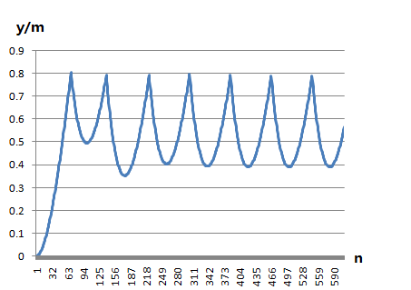
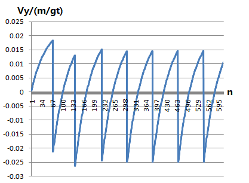
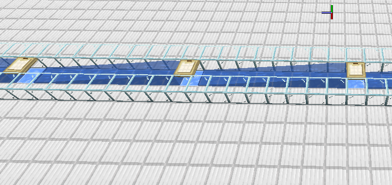
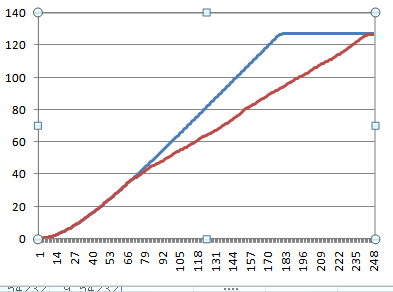
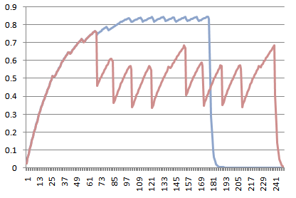
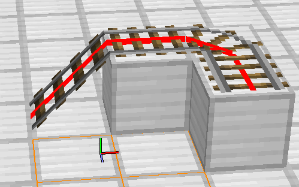

# 几类具体实体运动分析

截止到1.16.4，Minecraft Java版中实体共有94种，在这里很难也没有必要一一对它们进行说明，这里就挑选10种最常见也最典型的实体从创建、运算、对外界影响和移除四方面进行较为详细的说明。其中，创建这一方面，所有实体都可以通过指令创建，可进行非常灵活的控制，除未指定时各属性默认为0或false外，几乎不存在固定的机制，下面不再说明。

以后如果**说某实体在哪里生成，就是说实体刚生成时的坐标在哪里**。

## TNT

TNT实体永远是实体运动研究中关注的焦点（尽管机制特别简单），不仅是因为自身的运动重要，更因为它是目前最重要的爆炸源，可以破坏方块，推动或杀死其它实体。

除了使用指令生成外，TNT可以由以下方式创建：

(1) 点燃TNT方块。在TNT方块收到激活后的第一次方块更新时、被打火石点燃、被着火的箭矢击中时以及被爆炸破坏时会消失，然后一个TNT实体会在该TNT方块所在方块网格底面中心处生成，该实体会拥有一个沿Y轴向上，大小0.2m/gt的初始向上Motion，和一个随机方向大小0.02m/gt的初始水平Motion，前三种情况下初始引信时间为80，被爆炸破坏时初始引信时间为10～39间一个整数。

(2) 使用发射器发射。此时行为与用红石点燃发射器正对方向的一个TNT方块无异。

TNT的运算过程如下（`TntEntity.tick()，50-74`）：

1. 如果没有noGravity标签，受到大小为0.04$m/gt^2$的重力加速度
2. 以当前Motion为位移趋势进行基于Entity.move()的移动
3. 各轴Motion乘以0.98，也就是说受到大小为0.02$gt^{-1}$的空气阻力
4. 如果着地了X、Z轴Motion乘以0.7，Y轴Motion减半并反转
5. 将引信时间减一
6. 如果引信时间等于0：
   1. 将自身标记为移除
   2. 在坐标上方0.06125m处产生一个4级爆炸
7. 流体相关更新（含流体推动）

由此可见，**TNT实体的运动运算流程是GMDF**（重力-\>移动-\>阻力-\>流体），重力加速度大小恒为0.04$m/gt^2$，空气阻力系数恒为0.02$gt^{-1}$。第四步中，若TNT着地了，水平Motion乘以0.7是说TNT实体会受到了0.3$gt^{-1}$的地面阻力，目的是使TNT快速停止运动，而Y轴速度减半反转（此时如果撞到一般方块而且没有与气泡柱相交Y轴Motion应为0）应该是为了防止TNT实体被粘液块和床弹起，不过这对气泡柱下拉TNT实体着地时也有较小影响。TNT实体的爆炸检查置于运动运算（流体加速除外）后意味着TNT在爆炸时已经进行的运动运算（流体加速除外）周期数与初始引信时间相同，同时也使得利用TNT在弱加载区块产生爆炸成为可能。

TNT创建时的初始Motion会使TNT实体跳起，并在4gt后达到高于初始坐标0.38423872m的最高点。如果点燃时它在平地上，它会在9gt后落地，落点距初始坐标0.16625224m，然后继续运动，直到第41gt才静止，此时距初始坐标0.20256773m。如果它在足够高的空中，它的水平速度不会衰减到0，最终会在下落73.45407581m后爆炸，如果在引燃前在其上方用完整方块挡住，则TNT最终会在下落79.84488503m后爆炸，水平方向上偏移了0.80164885m。

最后，重要的事情说两遍不算多，**TNT的爆炸中心在其坐标上方0.06125m处**。

## 下落的方块

在受重力影响的方块下方失去支撑后的第一次更新后2（一般重力方块）或5（龙蛋）gt后的计划刻阶段一个下落的方块实体会在该方块所在方块网格中心所在竖直线上的一个点生成，生成时中心与方块网格中心重合，没有初始Motion。需要知道，因为某些不明的打算，该方块此时仍然存在。

重力方块的运算流程大概如下（`FallingBlockEntity.tick(), 98-192`）：

1. 检查创建下落的方块的那个方块是否被替换（活塞是否无头等仅状态替换不算），如果是，将自身移除并结束运算，否则移除该方块
2. 如果没有noGravity标签，受到大小为0.04$m/gt^2$的重力加速度
3. 以当前Motion为位移趋势进行基于Entity.move()的移动
4. 如果是混凝土粉末且现在坐标所在方块网格中存在水，复原为方块状态，然后立即固化
5. 如果Motion大于1m/gt，而且是混凝土粉末，进行一次移动前后两点间检查固体方块和流体源的碰撞箱的raycast，如果被水源阻挡，在阻挡射线的水那里复原并固化。
6. 如果坐标超出了可放置方块的上下限且已下落的时间在100gt以上或坐标仍在可放置方块范围内且下落的时间已经超过600gt，游戏规则允许实体掉落物品，而且没有着地，则掉落成物品并移除自身
7. 如果着地了X、Z轴Motion乘以0.7，Y轴Motion减半并反转
8. 如果已经着地且当前位置方块可以被落沙替换且复原后的方块能稳定存在（如铁轨不能浮空），在坐标所在方块网格中复原，否则掉落成物品
9. 各轴Motion乘以0.98，也就是说受到大小为0.02$gt^{-1}$的空气阻力

可以看出，**下落的方块实体的运动运算流程是GMD**，空气阻力和重力加速度与TNT实体相同，另外请注意下落的方块没有进行流体加速。第一步个人猜测是修复一种活塞单维度刷沙机用的，因为落沙实体的创建是在NTU（计划刻）阶段，第一次运算是在EU（实体运算）阶段，而活塞伸出正好位于这两个阶段中间（BE，方块事件阶段），所以如果没有这一个是否被替换的检查而直接删除方块，利用0t活塞就可以推走沙子并完成一次复制了。第4-5步Mojang可谓是想尽了办法让混凝土粉末落沙"不错过"途中的任何水方块，算是...不过特性还是有点，如射线可以穿过流体顶部的缝隙等。第7步我认为是多余的，因为此后该实体就复原或者掉落成物品了，不会再进一步移动，不排除是某个版本的遗留代码。第8步中可以被落沙替换的方块需要满足以下条件：

(1) 不能作为可下落方块的支撑方块

(2) 能被玩家放置方块替换

Wiki以前上说落沙在很高的高空落下时可能会在触及地面前就掉落成物品了（具体出处已不可考），这在MinecraftJE1.0及以前确实如此，那时下落的方块会在生成100gt后被移除，但是至少在1.7.10之后就是现在的情况了，也就是一般不会那么短时间就掉落。

现存的末地门刷沙机的原理是在同一游戏刻内第3步移动的过程中使实体同时做到与末地门相交且在合适的地方着地，然后虽然末地门传送走了落沙实体（在新维度创建了新实体并把旧实体标记为移除），但落沙实体这一游戏刻的运算并不会因此终止，甚至还可以正常地复原，所以就复制了两份沙子------复原的一份和被传送的一份。不过，因为落沙实体无法通过下界传送门被传送，所以地狱门刷沙机并不可行。

## 物品

获取物品实体的途径有很多，常见的有：

(1) 破坏方块。这时游戏会等可能地选取将被破坏方块的方块网格从各方向向内缩0.25m后的区域中的一个点并在该点处生成一个物品实体，然后分别给实体X、Z轴上一个-0.1～0.1m/gt之间（平均分布）的的初始Motion，给Y轴上一个固定向上且大小为0.2m/gt的初始Motion。如果该方块掉落了多个物品实体，它们的位置和初始Motion可以不同。如果方块是被爆炸破坏的，那么这些物品实体在开始运算前会被尝试合并一次。

(2) 杀死实体。这时游戏会在实体坐标处生成一个物品实体，然后分别给实体X、Z轴上一个-0.1～0.1m/gt之间（平均分布）的初始Motion，给Y轴上一个固定向上且大小为0.2m/gt的初始Motion。

(3) 由部分实体掉落。下面给出的几例杀死实体类似，只是初始位置一般要比杀死实体高一点。这一高度差对于被修剪的雪傀儡是1.7m，对于合成面包的农民是0.5m，对于被修剪的羊和刚成年的海龟是1m，对于被拾起的箭和三叉戟是0.1m。

(4) 由发射器或投掷器发射。选取发射器或投掷器的中心，向发射器或投掷器的朝向偏移0.7m，再向下偏移0.15625m（发射器或投掷器朝向为东西南北四个方向之一时）或0.125m（发射器或投掷器朝向为上下两个方向之一时），在此处生成一个物品实体，给它一个方向为发射器或投掷器的朝向，大小为0.2～0.3m/gt中（朝向Y轴时恒为向上0.2m/gt）一个值（平均分布）的初始Motion，最后再在各轴上分别（各轴上可以不相同）加上一个分布满足平均数为0，标准差为0.045m/gt的正态分布的随机Motion作为误差。正态分布意味着误差实际上有极其微小的概率远大于标准差，需要注意。

(5) 村民共享食物、赠送礼物和猪灵丢出交易品。首先游戏会选定一个目标坐标和出发坐标，目标对村民来说位于目标实体坐标处，对猪灵来说位于目标实体坐标上方1m处，出发坐标则总是投掷者眼部坐标下方0.3m处。然后，游戏会在出发坐标处创建物品并将其Motion设置为从出发坐标指向目标坐标，大小数值上为出发坐标和目标坐标间距离的0.3倍的一个向量。注意此时不存在随机性。

物品实体的运算流程大致如下（`ItemEntity.tick(), 77-153`）：

1. 进行实体基础运算（见2.4节）
2. 若拾起冷却不为32767则减一
3. 若在流体中且浸入高度大于0.10138889m，受到对应流体的浮力作用和流体阻力，否则，如果没有noGravity标签，受到大小为0.04$m/gt^2$的重力加速度
4. 如果卡在了方块或固体实体中或与固体实体相接触，则禁用碰撞检查（noClip设为true）并尝试进行从方块中被推出的运算，否则重新启用碰撞检查
5. 如果没有着地，或者水平Motion大小大于$\sqrt{0.00001}$m/gt，或者实体ID与实体已存在的刻数（最初为0）的和为4的倍数，则：
   1. 以当前Motion为位移趋势进行基于Entity.move()的移动
   2. 如果实体着地了，取k=0.98与坐标下方一格处方块滑度的积，否则k=0.98
   3. 将X、Z轴Motion乘以k，Y轴Motion乘以0.98
   4. 如果着地了且当前Y轴Motion小于0，将其减半并翻转
6. 如果实体此次移动过程中进入了新的方块网格且实体已存在的刻数为2的倍数，或如果实体此次移动过程中没有进入新的方块网格且实体已存在的刻数为40的倍数，尝试合并一次
7. 增加已存在的刻数计时
8. 再次进行流体相关运算（含流体加速）
9. 如果已存在的刻数大于6000则标记为已移除

这里可以看出，不考虑浮力和从实体方块推出的过程，**物品实体的运动运算顺序为$F_1GMDF_2$**，也就是说它在每刻中分别在实体基础运算和第8步时进行了两次流体加速，这是比较罕见的，目的可能是提高物品运输的速度。第5步比较有趣，这意味着物品实体在着地且Motion接近0时（如在地面上滑动时）每4gt才运算一次移动和阻力，而且运算的具体时间与其实体ID（或者说就是创建的序号，同一时间内创建的一般连续）和已存在的的时间有关，这已经被应用于无线红石。**\[13\]**注意5.4步中的反转速度由于有速度小于0的判断并不会造成粘液块无法弹起物品实体，用意未知，不排除SBMojang。

在物品实体进入足够深的水中时，它不会受到重力，在X、Z轴上会受到一个大小为0.01$gt^{-1}$的流体阻力，这会和空气阻力叠加，而且在Y轴Motion小于0.06m/gt时还会受到一个竖直向上大小为0.0005$m/gt^2$的浮力加速度。

在物品实体进入足够深的熔岩中且未与水接触时，它也是不会受到重力，在X、Z轴上会受到一个大小为0.05$gt^{-1}$的流体阻力，这会和空气阻力叠加，而且在Y轴Motion小于0.06m/gt时还会受到一个竖直向上大小为0.0005$m/gt^2$的浮力加速度。

尽管水中的掉落物会自己飘较远的距离，但这并不是随机加速度作用的结果，实际上根本就没有这回事。水中的物品的较远距离漂浮就是创建时有初始速度和阻力系数较小的结果。在一格的静止的水底生成的物品实体的部分运动相关数据如下（X、Z轴没有必要研究）：



> 图7.3.1 位移与时间关系曲线



> 图7.3.2 速度与时间关系曲线

可以看出，实体的速度发生了几次突变，这是实体在入水深度过浅时受到重力加速度作用导致的。另外，高度呈现出明显周期变化，但始终不至于再次着地。

图7.3.3这一种物品运输很多人都做过，这里来研究一下。



> 图7.3.3 典型水道物品运输

在物品实体静止从水底生成通过125m长的这种物品运输装置并最终停止的过程中物品实体的水平速度及位移随时间变化规律如下（红线为纯铁块地面，蓝线为纯蓝冰地面）：



> 图7.3.4 位移与时间关系曲线



> 图7.3.5 速度与时间关系曲线

由此看出，使用铁块作为地面时，实体稳定后的速度随时间在大约0.35m/gt-0.7m/gt之间来回变化，但没有明显的周期性，而且物品实体加速到稳定所需的时间和位移分别约是20gt和8m，此后至结束时物品的平均速度约为0.527m/gt，或者说不卡顿时为10.54m/s。使用蓝冰作为地面时，71gt（34m）前速度与铁块地面相似，71gt后速度有较大提高，稳定时平均速度大约在0.832m/gt左右，约合无卡顿的16.64m/s。进一步实验表明，将两段水流中间附近的地面换成蓝冰就可以达到与纯蓝冰水道相近的速度，但其他地方由于实体不会着地，受不到滑度影响，所以将地面全部换成冰无法进一步提高运输速度。

可能得问了，物品与流体到底啥关系，在这里差不多光说流体的影响了。实际上，物品的运动研究主要还是在流体和冰道运输以及物品收集，但冰道运输只是滑度和粘液块弹射的结合，没有特殊内容，而收集装置设计上还是靠实验比较好，真正的计算并无一般规律，在此从略。

## 经验球

获取经验球实体的方法主要有：

(1) 部分实体掉落。在这种情况下，一些经验球会在实体坐标处生成（交易除外，这时是在坐标上方0.5m处）并在X、Z轴上分别被随机赋予±0.2m/gt之间的一个初始Motion（平均分布，下同），在Y轴上被随机赋予一个0～0.4m/gt的初始Motion。

(2) 破坏一些方块。此时一些经验球会在被破坏的方块所在方块网格中心处生成，初速度情况与第一种相同。

(3) 从熔炉掉落。此时一些经验球会在玩家坐标处生成，初速度情况与第一种相同。

(4) 附魔之瓶撞击方块。此时一些经验球会在发生碰撞前最后一刻的坐标处生成，初速度情况与第一种相同。

经验球的运算流程大致如下（`ExperienceOrbEntity.tick()，49-111`）：

1. 进行实体基础运算（见2.4节）
2. 拾起冷却则减一
3. 取眼部坐标下方1/9m处的一个点，若该点所在的方块网格中的流体为水且浸没了该点，在X、Z轴上受到大小0.01$gt^{-1}$的流体阻力，在Y轴上受到0.0005$m/gt^2$的浮力加速度并把Y轴Motion限制在0.06m/gt及以下，否则，如果没有noGravity标签，受到大小为0.03$m/gt^2$的重力加速度
4. 如果坐标处方块网格中有熔岩，在X、Z轴上赋予一个满足众数为0的三角分布的，随机在±0.2m/gt间的Motion并在Y轴上赋予一个一个0.2m/gt的向上Motion
5. 如果卡在了方块或卡在固体实体中或与固体实体相接触，尝试进行从方块中被推出的运算
6. 如果20减去距上一次更改目标以来的刻数大于实体ID与100的模
   1. 如果没有选定的目标、原目标距离大于8m或已被放弃则寻找坐标8m内最近的非旁观者玩家作为新目标玩家
7. 如果现在的目标玩家是旁观者就放弃该目标
8. 选取目标玩家坐标与眼部坐标连线中点为目标点，如果目标点与自身坐标距离小于8m，沿从自身坐标向目标点方向，受到大小为$0.1 \bullet (1 - \frac{距离}{8})^{2}m/gt^{2}$的加速度
9. 以当前Motion为位移趋势进行基于Entity.move()的移动
10. 如果实体着地了，取k=0.98与坐标下方一格处方块滑度的积，否则k=0.98
11. 将X、Z轴Motion乘以k，Y轴Motion乘以0.98
12. 如果着地了，将Y轴Motion乘以0.9并翻转，以此防止被粘液块弹起
13. 如果已存在的刻数大于6000则标记为已移除

由此得出，**经验球的运算流程主要为FGMD**，运动机制与物品实体略有相似。第4步中实体的那个加速度可理解为经验球会慌不择路地逃离熔岩，不过成功率不大高。第6、7步中目标的选择不排除玩家是否已经下线或是否仍在该维度，所以如果玩家在经验球靠近的时候下线或者被传送到另一维度且坐标与在原维度时坐标接近，经验球就会在玩家下线的位置或与在另一维度玩家的坐标相同的原维度的坐标处继续飞行而不更换目标。两个字，专一！（不过应该还是特性，据说1.17已修复）第8步中经验球靠近玩家是利用加速度进行的，所以在到达目标位置后如未被玩家拾取就会出现刹不住车的情况，进而就在目标点附近来回飞行，直到被玩家拾取或被清除。

## 船

船的获取方式应该只有两种，而且都没有初始Motion

(1) 使用物品形式的船放置。此时游戏会选取玩家正对的点，并检查如果创建一个将碰撞箱从各方向向内缩0.1m后的船会不会被阻挡。如果不会，一只船会在该点处生成，朝向偏航角与玩家相同

(2) 使用发射器发射。此时如果发射器正对的位置有水，游戏会选取一个从发射器所在方块网格中心沿发射器朝向偏移1.125m后再向上偏移1m后得到的一个点，在这里生成一只朝向与发射器朝向一致的船，发射器朝下或朝上时船总是朝东。类似地，如果发射器正对的位置下方有水，游戏会选取一个从发射器所在方块网格中心沿发射器朝向偏移1.125m后所得的一个点，在这里生成一只朝向与发射器朝向一致的船，发射器朝下或朝上时船总是朝东。

注意，第一种方法中船的有机会卡到方块中，第二种则完全不进行碰撞检查，由此也可以把船卡到方块中，第二种方法甚至可以轻松地制造堆叠的船。

船的运算流程大致如下（`BoatEntity.tick(), 235-312`）：

1. 更新船的位置及滑度记录
2. 如果船连续在水下60gt，移下所有骑乘者
3. 实体基础运算
4. 客户端与服务端间位置同步相关运算
5. 根据现在的位置决定阻力系数f，设$k=1-ft_0$
6. 将水平速度和偏航角的角速度分别乘以k
7. 如果没有noGravity标签，受到大小为0.04$m/gt^2$的重力加速度
8. 如果在水中，Y轴受到一定的阻力和微量加速度用于产生上下浮动效果
9. 如果玩家按住了且只按住了A、D键之一，向对应方向将偏航角偏转角速度加上$1{^\circ}/gt$
10. 将偏航角加上偏航角角速度与1gt的积
11. 如果玩家没有按住W、S键且按住且只按住A、D键之一，取0.005$m/gt^2$作为前向加速度；如果玩家只按住了W键，取0.04$m/gt^2$作为前向加速度；如果玩家只按住了S键，取-0.005$m/gt^2$作为前向加速度；如果玩家同时按住了W、S键，取0.035$m/gt^2$作为前向加速度
12. 给船一个朝向船的视线的水平投影方向，大小为前向加速度大小的加速度
13. 以当前Motion为位移趋势进行基于Entity.move()的移动
14. 进行气泡柱相关的运算
    1. 如果连续接触了向下的气泡柱达到60gt，使船下沉（Y轴Motion设为-0.7m/gt）并移下所有骑乘者
    2. 如果连续接触了向上的气泡柱达到60gt，给船2.7m/gt（有玩家骑乘时）或0.6m/gt（无玩家骑乘时）的Y轴Motion
    3. 如果同时接触了两种气泡柱，以东南方为准，其中东方优先
15. 再次检查方块网格碰撞（`checkBlockCollision()`）
16. 如果可能，尝试使与碰撞箱向四周扩大0.2m后得到的区域相交（不计边界）的可被挤压的实体（船上下方的实体不被检查）上船，否则尝试对其进行挤压

相对来说比其它的复杂一些，不过差不多可以理解。**船在X、Z轴上的运算顺序主要为FDCM**，在第三节已经初步说明了。竖直方向上比较特殊，**当船在空中运动时Y轴上是不受空气阻力的，运算顺序为GM**，所以只要船的初始位置足够高，船就几乎可以无限加速，直到速度太大以至于远距离碰撞检查把服务器卡到崩溃（至少每gt下落几十万米不掉刻是不成问题的）或者由于浮点数的离散型无法加速。第15步中多出的那次检查用意暂时不能确定，只是想增加仙人掌的伤害也说不定。

船的阻力系数在不同位置的大小如下表：

> 表7.5船的阻力系数

| 状态         | 水平方向（单位$gt^{-1}$） | 竖直方向（单位$gt^{-1}$） |
|---------------|-----------------------|-------------------------|
| 入水瞬间 | 0.95 | 0 |
| 水面 | 0.1 | 0.25 |
| 浸没于流水 | 0.1 | 0 |
| 浸没于静水   | 0.55 | 0.25 |
| 空中| 0.1| 0|
| 无水的地面上 | 将下方直接接触的方块滑度做平均，然后1减去这个平均值就是阻力系数的数值 | 0 |

由阻力和动力大小结合对应公式可以容易地推算出：只按住W键控制时，在水面上和空中，船的最终水平速度趋近于0.4m/gt；在普通地面上，船的水平速度最终趋近于0.1m/gt；在浮冰和霜冰上，船的水平速度最终趋近于2m/gt；在蓝冰上，船的水平速度最终趋近于3.63636m/gt。但是在粘液块地面上并不能这样推算，因为粘液块本身有个减速作用。实验表明，在粘液块上，船的水平速度最终趋近于0.05907m/gt。存档中有几条冰道，本来计划测试一下混合冰道上的最终速度（按窃梦者的研究**\[5\]**应该是可以理论计算的），但因电脑性能问题未能完成，希望哪位好心人帮忙测试一下。

船的运动（5～13步）只在服务端和客户端中的一个地方运算，另一端的Motion为零，坐标滞后。当船被玩家骑乘时，船的运动是在客户端运算的，否则是在服务端运算的，所以当船在快速行进时玩家突然下船就会导致两端的坐标停止同步从而出现大小为1gt的位移的偏差。又因为玩家刚下船时服务端的船的Motion仍为0，所以服务端无法自行用船拥有的Motion让船继续运动调整这个误差，进而导致船的真碰撞箱留在了玩家下船的地方。服务端认为玩家在就在碰撞箱的上面，但在客户端碰撞箱随船已经移走了，它认为玩家可以下落，但是服务端一看不对就又将客户端玩家TP回来，其它如向外移动的请求也随之被驳回，于是玩家就被卡在了船的服务端的碰撞箱中。解决方案也简单，那就是破坏掉那只船，只要找到客户端的船攻击它既可。另外，角速度的同步大致也是这样的，所以就有了另一个类似的Bug**\[14\]**。这样的关于两端同步的Bug还有很多，最经典的就是MC-4，这里不再多说。

实体被动上船需要满足以下条件：

(1) 船上没有玩家

(2) 船上的直接骑乘者总数小于2

(3) 实体没有骑乘其它实体（不能脚踏两只船）

(4) 实体的宽度小于船的宽度（1.375m）

(5) 实体是水生生物外的生物

(6) 实体没有潜行且骑乘冷却时间已结束

(7) 队伍规则允许实体挤压

了解了这些，还有第16步中给出的那个范围，估计得少跟村民费不少劲。第7条可能是一个Bug，以后可能修复。

实际上船还有一个摔坏的机制，似乎是要求船在上一gt位置距离地面0.001m以内且摔落前FallDistance大于3，这是可以通过让船在某些高度摔落（如3.12m和12m）并利用重力存储的浮点数误差得到。**\[25\]**

## 矿车

矿车的运算流程比较复杂，而且也已经有很多详细的研究资料了**\[15\]**，下面仅列出几点零星的，主要是比较偏门的研究结果。

矿车的主要获取方法如下，创建的矿车均无初速：

(1) 在轨道类方块上使用矿车物品，初始位置位于轨道所在方块网格底面中心上方0.0625m处。

(2) 使用发射器向轨道类方块发射，发射器与轨道同向时初始位置会偏向发射器所对的方向0.1625m。

矿车脱轨移动时运算流程大致如下（`AbstractMinecartEntity.tick(), 258-360`）：

1. 在Y坐标小于-64时破坏自身
2. 下界传送门相关更新（`tickNetherPortal()`）
3. 如果没有noGravity标签，受到大小为0.04$m/gt^2$的重力加速度
4. 将X、Z轴Motion限制在最大速度（±0.4m/gt）以内
5. 如果着地了，受到0.5$gt^{-1}$的地面阻力，Y轴Motion减半，然后以当前Motion为位移趋势进行基于Entity.move()的移动，否则先以当前Motion为位移趋势进行基于Entity.move()的移动，然后受到0.05$gt^{-1}$的空气阻力。
6. 寻找与碰撞箱向东西南北四个方向扩大0.2m后的区域相交（不计边界）的可被挤压的实体，如果可能使它乘上矿车，否则尝试将其挤开。
7. 流体相关运算

不考虑达到速度大小上限，在着地时，矿车的运算顺序为DMF，否则为GMDF。上述运算过程中3-5步是脱轨运动特有的。

大量堆叠的矿车每刻运算结束时的水平Motion会以指数爆炸的方式递增，最终可以达到正/负无穷大（浮点数上溢的结果）。堆叠的矿车越多，所需时间越短，堆叠300矿车时从矿车错位开始到Motion达到无穷大仅需不到一秒的时间。听起来很吓人，但实际上因为速度限制，这并不会使速度也达到无穷大。实际上，在地面上时，由于强制限速这种矿车的运行速度最大也只有$4\sqrt{2}$m/gt，说不定速度限制就是因为这个引入的。但是，一旦Motion开始这个指数爆炸过程，在区块彻底卸载前Motion就不会下降，所以矿车就会在水平方向上保持匀速直线运动（MC-14）。在区块重载后，Motion也会很快地恢复无穷大，然后继续做上述运动。原因很可能隐藏在`pushAway()`方法中，因为在速度被限制到运算结束可能加速的阶段就只有这一个了。现在，这一Bug已经被报告给Mojang了（MC-14），之后也许会修复。

实体被动骑上矿车需要满足以下条件：

(1) 实体是船或者除蝙蝠、铁傀儡之外的生物

(2) 实体没有骑乘或被骑乘

(3) 矿车是空的可骑乘矿车

(4) 矿车的水平Motion大于0.1m/gt

(5) 实体没有潜行且骑乘冷却时间已结束

(6) 队伍规则允许实体挤压

容易得到，船是没有被排除的，所以平时船套矿车严格意义上来说是矿车套船。第4条估计大部分人都不了解，知道这一条拿矿车运输村民也简单多了。

矿车在移动过程中如果发现坐标处方块网格或坐标所在方块网格下方处存在铁轨就会以最短位移被TP到铁轨指定的轨迹上，其中下方铁轨优先（联想一下连续浮空铁轨）。铁轨指定的轨迹对于直轨是距离方块网格底面0.0625m处的一个水平截面上一对相对的棱中点的连线，对于弯轨是距离方块网格底面0.0625m处的一个水平截面上一对相邻棱中点的连线，对于斜轨是方块网格一个体对角面的两短边中点连线正上方0.0625m的线段。矿车在铁轨上时总是沿这些指定的轨迹行进。图7.6是一个典型的例子，注意铁轨底部均高出地面0.0625m：



> 图7.6 一段铁轨指定的轨迹
>

矿车在轨道上的运动很大一部分是靠TP来完成的，所以一不注意就会卡在方块内部，特别是弯轨，非常Buggy。

TNT矿车在以大于0.1m/gt的水平Motion撞到方块时、从超过3m的空中落下时和引信时间结束时会发生爆炸，前两种和第三种情况下最大爆炸威力分别与Motion和FallDistance有关，而且有随机性。因为爆炸检查时普通矿车的基础运算已经完成，堆叠的矿车可以轻易地把最大爆炸威力提高到最大值11.5，这时实际爆炸威力在4～11.5之间等可能地选取。

## 箭矢

可以说，研究箭矢的运动也许不是最有用的，但一定是研究人数最多的，估计几乎每个Minecraft玩家都或多或少地练习过箭矢的发射技术。

箭矢的常见获取方法有:

(1) 玩家发射。此时箭矢会在玩家的眼部坐标下方0.1m处生成，然后被赋予大小以m/gt为单位时数值为蓄力刻数（2-20间一个整数）的0.15倍，方向朝向玩家视线方向的初始Motion，最后再在各轴上分别（各轴上可以不相同）加上一个分布满足平均数为0，标准差为初始Motion大小的0.0075倍的正态分布的随机Motion作为误差，即(`ProjecileEntity.java, 92`)：

```java
Vec3d finalVelocity = velocityInuptWithoutInaccuracy.normalize()
    .add(this.random.nextGaussian() * 0.007499999832361937D * (double)divergence, 
    this.random.nextGaussian() * 0.007499999832361937D * (double)divergence, 
    this.random.nextGaussian() * 0.007499999832361937D * (double)divergence)
    .multiply((double)speed);
```

正态分布意味着误差实际上有极其微小的概率远大于标准差，但是，因为浮点数表示数值下限不够小，使箭矢因误差反向发射仍是不可能的。最后，箭矢的Motion会被叠加上玩家的水平Motion，如果玩家未着地还会叠加上玩家的Y轴Motion。

(2) 生物发射。这种情况与玩家发射类似，不同的是箭矢的初始Motion大小总是1.6m/gt，而且误差的标准差是随难度改变的，简单、普通和困难难度下分别为玩家的10、6和2倍。生物的箭矢发射方向与它们的视线方向无直接关联，应该是只与目标位置有关。这种发射不会叠加发射者的Motion。

(3) 发射器发射。此时箭矢会在发射器所在方块网格中心沿发射器朝向偏移0.7m外的地方生成，初始Motion为1.1m/gt，误差标准差为玩家的6倍。

箭矢的运动运算流程大致如下：（`ArrowEntity.tick(), 102-119`、`PersistentProjectileEntity.tick, 123-249`）：

1. 更新离开发射者状态、进行实体基础运算
2. 如果当前坐标位于当前坐标所在方块网格中方块碰撞箱内部（对于边界的判定似乎有方向性），判定为卡到了方块内部
3. 如果被判定为卡到了方块内部且卡进去的方块被替换为其它方块，检查以坐标为中心棱长0.12m的立方体中是否没有任何方块和固体实体的碰撞箱，如果真没有就将现有Motion各轴分量分别乘以一个\[0,0.2)之间的数（各轴上可以不同）、重新认定没有卡到方块内部并结束运算，否则，若累积卡在方块中的刻数超过1200则移除自身并结束运算
4. 将现有坐标加上现有Motion与1gt的乘积（不改变实际坐标）计算出目标坐标
5. 进行基于raycast的碰撞检查以检查目前坐标到目标坐标的路径上有没有发生碰撞，若有则进行对应处理
6. 如果实体与水接触，受到0.4$gt^{-1}$的流体阻力，否则受到0.01$gt^{-1}$的空气阻力
7. 如果没有noGravity标签，受到大小为0.05$m/gt^2$的重力加速度
8. 更新坐标和碰撞箱
9. 检查方块网格碰撞（`checkBlockCollision()`）
10. 如果箭矢为药箭且进入方块的连续时间超过600gt就清除附带的状态效果

可以得出，**箭矢的运动运算顺序主要是FDcDGPu**（流体-\>位移计算-\>阻力-\>重力-\>位置更新），在不考虑触发绊线勾、气泡柱加速等事件的情况下可以当成是**FMGD**。

在箭矢与方块发生碰撞时首先会触发方块被弹射物击中时的行为，如火矢箭点燃TNT、激活标靶方块、击落紫颂花等，然后箭矢的暴击、穿透、从弩发射等属性会丢失，Motion会被设为方向为从方块网格的西北偏下的顶点到击中方块前箭矢最后的位置的一个向量，并将坐标按与原向量相反的方向移动0.05m，除非Motion为0。等到运算进行到第3步，如果条件合适，箭矢就会以一个与撞击位置及撞击时Motion有关的，带有一定随机性且不超过现有Motion的0.2倍的新Motion继续运动。

如果箭矢撞击到了可以被该箭矢伤害的实体，实体会受到大小为箭矢合速度大小以m/gt为单位时的数值与Power标签的乘积的向上取整结果的伤害，在箭矢有暴击属性时，这一伤害会加上\[1,原伤害一半+1\]中一个整数，但不会超过2147483647点。如果箭矢有冲击属性且Motion不趋近于0，被击中实体的Y轴Motion会被设为0.1m/gt，水平Motion会沿箭矢水平Motion方向设为0.6m/gt与冲击等级的积。对于玩家射出的箭，Power标签与弓的力量附魔有关，无力量附魔时为2，有力量I时为3，以后每级增加0.5。箭矢伤害和速度相关意味着给箭足够大的速度就可以对被攻击者造成极高的伤害，这已经被应用于屠龙炮等设备，8.2.3节对此略有说明。

箭矢每次进行基于Entity.move()方法的移动后会进行一遍类似上面第3步的检查，只是在发现碰撞箱时不增加计时而已。

另外，很反常识，箭矢在熔岩中的阻力竟然比在水中小，因为箭矢只有在水中时才受到流体阻力，在熔岩中受到的阻力和空中相同。

虽然说这是箭矢的分析，但三叉戟的运动与之相比很相似，只是在水中的阻力系数也是0.01$gt^{-1}$，而且不存在第10步。忠诚三叉戟返回时不再进行碰撞检查（noClip设为true）并在击中目标后$\frac{1}{0.05附魔等级}gt$内返回。

## 雪球

获取雪球实体的方法主要有：

(1) 使用雪球物品。这种情况与玩家使用弓发射箭矢类似，只是初始Motion大小为1.5m/gt，各轴随机加速度分布的标准差为0.01125m/gt。

(2) 使用发射器发射。这种情况与发射器发射箭矢相同。

(3) 由雪傀儡投掷。这种情况与生物发射箭矢相似，只是误差的标准差恒为玩家的12倍。

雪球实体的运算过程大致是（`ThrownEntity.tick(), 48-97`）：

1. 更新离开发射者状态、进行实体基础运算
2. 进行基于raycast的碰撞检查以确认目前坐标到目标坐标的路径上有没有发生碰撞
   1. 如果撞到的方块是下界传送门就计划下一刻进行下界传送门门相关运算时被传送，是折跃门方块就尝试立即被传送。但是，由因为1.16.2 Pre-2中的一个改动，这种情况是不可能出现的。
   2. 否则进行撞到的方块或实体对应的运算
3. 检查方块网格碰撞（`checkBlockCollision()`）
4. 根据目前Motion确定该游戏刻中的移动的目标位置，不受碰撞检查影响
5. 如果实体与水接触，受到的流体阻力，否则受到0.01$gt^{-1}$的空气阻力
6. 如果没有noGravity标签，受到大小为0.03$m/gt^2$的重力加速度
7. 更新坐标和碰撞箱

与箭矢类似，**雪球的运动运算顺序仍主要是FDcDGPu**，在不考虑触发绊线勾、气泡柱加速等事件的情况下可以当成是**FMGD**。

第3.1步中，虽然实体进行了额外检查，但是因为两种传送门都没有碰撞箱，在这里的raycast中无法被检测到，所以速度足够大时仍会错过传送门。说不定这个特性就是Bugjump修复MC-73844时修出来的。

由于雪球的坐标和碰撞箱是在最后更新的，所以在一些关于坐标的计算中需要将n值减去1后才可以代入公式使用。

在雪球自己击中（不含活塞推动击中）方块时会触发方块在弹射物击中时的行为并移除自身。在雪球击中实体时会对实体造成0（一般实体）或3点（仅烈焰人）伤害并移除自身。0点伤害除不会对被攻击实体的生命值造成影响外，其它性质与一般的攻击相同，如击退仍会发生、击中末影水晶时水晶仍会被破坏等。

不仅是雪球，玩家掷出的各种其它投掷物的运动机制都与此类似，但是附魔之瓶和药水的重力分别为0.07$m/gt^2$和0.05$m/gt^2$，初始Motion大小分别为0.7m/gt和0.5m/gt，具体运动情况略有偏差。

需要补充的是，在**1.21.2**当中，雪球和珍珠等投掷物的运算顺序被修改为了**GDMF**，而且重力加速度也从单精度浮点数改成了相应数值保留小数点后两位得到的双精度浮点数。这一改变使先前的珍珠矫正设计大规模地失效。

## 恶魂火球

恶魂火球实体的获取方法应该只有恶魂发射。此时，游戏会选取会选取恶魂的碰撞箱中心上方0.5m的一个点，并沿恶魂的视线方向偏移4m得到起始点，并在这个点处生成一个火球，并设定它每gt受到一个从出发点指向目标实体的碰撞箱中心，大小为0.1$m/gt^2$的加速度（如果两者几乎重合则没有这一加速度，这一点可被用于火球的矫正**\[20\]**），没有初始Motion。

恶魂火球的运算流程大致如下（`ExplosiveEntity.tick(), 62-97`）：

1. 更新离开发射者状态、进行实体基础运算
2. 检查方块网格碰撞（`checkBlockCollision()`）
3. 根据当前Motion确定位移
4. Motion加上设定的加速度（由`Power`标签决定）
5. 如果在水中，受到受到0.2$gt^{-1}$的流体阻力，否则受到0.05$gt^{-1}$的空气阻力
6. 更新坐标和碰撞箱

由此得出，**恶魂火球的运算顺序为FDcCDPu**,在总是接触到水或总是接触不到水的情况下可以当成是**FMCD**。

通常都认为，恶魂火球是做匀速直线运动的，但其实不然，从火球加入到现在火球一直都不是匀速直线运动的。恶魂火球的初始Motion为0，其速度是由其运算过程中的第4、5步决定的，在设定的恒定加速度和阻力的共同作用下，大小很快趋近于一个定值，而合加速度会以指数方式衰减，半衰期大约是13.51gt（换句话说就是说恶魂火球在不到三秒的时间内就会加速到最大速度的90%）而且因为不受重力，速度方向不变，所以看起来像匀速直线运动。

在火球被击中时，它的Motion会被设为与攻击者（对于弹射物直接造成的攻击，攻击者是发射者）视线方向同向，大小等于1m/gt的向量，加速度会被重新设为沿攻击者视线方向，大小0.1$m/gt^2$的一个向量，而且主人会被改为攻击者。也就是说，恶魂火球被打回去后的运动与被打回去前运动除打回去的一刻坐标相同外并无直接关联。

## 玩家

玩家在初次生成或死亡重生时没有初始Motion，位置位于重生点附近的地面上；在下线后重新上线时会被生成在上次下线的地方，Motion与上次下线时服务端玩家的Motion相同，除非某轴上Motion大于10m/gt。

玩家（LivingEntity）的一般运动运算流程在第6节已经进行了说明，这里主要讲玩家的特殊运动机制。

众所周知，玩家的运动运算主要在客户端进行，只有在有必要时（鞘翅飞行、活塞推动和触发反作弊等）才在服务端进行运算。

在客户端，玩家每秒的运算次数与帧率有关，每帧玩家最多运算10gt的运动，所以在帧率低于2FPS时玩家的运算就会被减缓，在帧率至少在20FPS以上才能保证玩家实体的正常运算。在客户端上玩家是随一般实体一并被运算的，顺序与服务端相似。

在服务端，玩家的运动是在每刻中所有维度的一般运算都完成后，自动保存和玩家输入处理前运算的，运算速率只与TPS相关。

如果某时玩家在两端中某一端运算，另一端一般不主动同步玩家的Motion，只是将玩家以Entity.move()移动到另一端指定的位置。例如，当客户端玩家在空中下落并尝试行走时，服务端玩家在计算的同时也发现玩家在下落，所以也有Y轴Motion。但是，服务端并不去同步客户端上玩家控制造成的速度，只是按客户端决定的位移把玩家移动到对应的位置，如果移动是正确的就TP到客户端的位置。

在客户端运算玩家的大部分运动有利于减少服务器TPS和延迟对操作体验的影响，也可能在某种程度上减少了服务器的负担，但是有部分人利用这一特性开发了一系列的外挂，常见的有飞行挂和速度挂。虽然Minecraft对玩家的输入进行了一定的检验（`ServerPlayNetworkHandler.onPlayMove(), 768-874`），也就是反作弊，但这种检验主要只是防止玩家速度远大于服务端玩家Motion、长时间非法浮空和非法穿墙等情况，并在前两种情况下将玩家TP回移动请求前玩家的坐标，但这并不足以防范大部分现有外挂。

关于客户端与服务端上的玩家运动情况，这两篇文章**\[16\]**也进行了一些分析。

玩家在运算时还会尝试主动拾起物品。具体来说，如果玩家在骑乘实体，与玩家的碰撞箱向四周扩大1m的范围相交的可拾起实体会被拾起；如果玩家没有在骑乘实体，与玩家的碰撞箱向四周扩大1m并向上下扩大0.5m的范围相交的可拾起实体会被拾起。

下面主要研究玩家在地面上时的直线向前运动情况。

玩家在进行AI加速时前向的和侧向速度系数只有5个值可取：没有按住对应移动控制键或按住对应相反的移动控制键（一般为WS或AD）时为0，按住对应的控制键且未潜行或使用物品时为±0.98，按住对应的控制键且在潜行或使用物品时为±0.294。根据附录B中式B.5.5可知，玩家的最终速度与加速度成正比，所以其它条件相同且只按下了前后或左右方向的控制键时，使用物品或潜行时的速度是正常情况的0.3倍。由于在各方向速度系数平方和大于1时会进行规格化，所以在正常行走时同时按住前后和左右方向的控制键时合速度不会明显加快，但是在物品或潜行时这样做会导致速度快$\sqrt{2}$倍。地面移动加速度以$m/gt^2$为单位的数值为`generic_movement_speed`属性值，玩家的基础值为0.1，最终值计算方式见6.2节。

可以计算出玩家行走时在普通方块地面上最终水平速度约为4.317m/s，在普通冰面上的最终速度约为4.242m/s，蓝冰上的最终速度约为4.464m/s，粘液块上的最终速度约为1.176m/s，空中的最终速度约为4.356m/s。

由于在疾跑时跳跃会有一个向前的加速，所以跑跳速度会更快，地面滑度较高时会更明显。但因为玩家在空中的速度慢于玩家在普通地面疾跑的速度（5.612m/s），所以应该存在一个临界初始跳跃速度，使得平均水平速度在跑跳后反而下降。