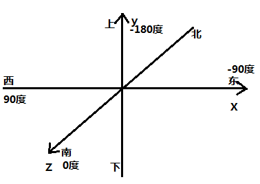
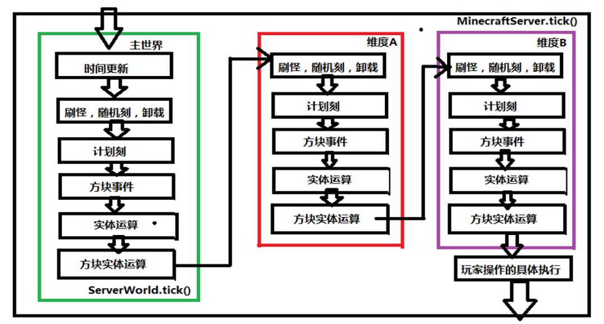

# 实体运动基础

## 实体运动基本属性及设定

在Minecraft中，所有实体都有以下**运动相关属性**：

(1) **碰撞箱**（碰撞体积，轴对齐边界箱，AABB）：一个长方体区域，标记实体占用的空间。碰撞箱由两个点指定，其中一个点的任意坐标都不小于第二个点的对应坐标，所指定碰撞箱是那两点之间的一个各面都垂直某一坐标轴的长方体。与实体渲染出来的样子不同，原版Minecraft中所有碰撞箱各沿轴视图都是矩形，俯视图都是正方形，而且不会随实体的朝向改变而旋转。

(2) **坐标**：表示实体的位置的一个点，位于实体碰撞箱底面的中心。Minecraft中的坐标系是一个典型的三维右手直角坐标系，规定东西方向分别为X轴的正负方向，规定上下方向分别为Y轴的正负方向，规定南北方向分别为Z轴的正负方向。与现实不同，实体的坐标变化不一定完全由速度决定，因为实体可以被以某种方式传送。在Minecraft中，还存在一个用于指定方块所在单元的**方块坐标**，由精确坐标到方块坐标的转换可以通过向下取整其分量进行（`BlockPos.java, <init>`）。

{width="2.5416666666666665in" height="1.801388888888889in"}

> 图2.1坐标系及偏航角示意图

(3) **Motion（又称动量，Momentum）**：可认为是一个存储速度及其运算中间量的容纳一个三维向量的容器，在每次加速和阻力作用时其中存储的"准速度"会被改变，在移动时其中的值会被作为位移（就是那一游戏刻的平均速度）使用。可以这样说，Motion决定速度，但是Motion的值并不总是严格等于速度，有时甚至会有很明显的差距，如阻力系数较大和被活塞推动时。说起来大家可能不信，堆叠的矿车被加速时其Motion会指数爆炸式增长，在经过一段距离（与堆叠数量有关，堆叠越多越短，堆叠100个时不到20m）后可以达到无穷大，但是其单轴速度永远不会大于0.4m/gt。不过，如果真的不喜欢这样，把后文中的Motion中大部分换成"速度"问题也不大，能理解就好。

(4) **速度**：表示实体在一定时间内不计传送的坐标值的变化量的一个三维向量。因为Motion除速度外还存储速度的运算中间量，所以实体的速度并不等价于Motion，尽管一般都认为它们是一回事。可以这样认为，Motion是实体运动的决定，而速度是实体运动的结果。

(5) **眼部坐标**：一个用于某些计算的点，x、z轴上坐标与实体坐标相同，但y轴上会比实体坐标高出来一点，默认为实体高度的0.85倍，但也有例外，如箭是0.13格，详见**附录A**。

(6) **俯仰角（pitch）**：用于描述竖直方向的朝向的一个角度，范围在-90度～90度，水平方向为0度，向上为负，向下为正。后文中用到的俯仰角皆以此为准，无论它是实体的一个属性还是一个纯粹的方向，下同。

(7) **偏航角（yaw）**：描述了实体的水平方向，即东西南北或是南偏东20度之类的。其取值范围在-180度（不含）-180度(含)之间，正南方对应0度，此处起顺时针为正，逆时针为负。

(8) **空气阻力系数（wiki上称"阻力"，对应一些公式中的"f"）**：实体在自由运动时会在各轴上受到一个大小等于对应轴上速度大小与对应轴上空气阻力系数的乘积，方向与对应轴上速度方向相反的阻力加速度，空气阻力系数表明了实体在自由运动时减速的快慢，其值越大，速度衰减越快。

Minecraft中与运动相关的**实体运算**主要有以下六种：

(1) **重力作用**（Gravity，简称**G**）

(2) **阻力作用**（Drag，简称**D**）

(3) **自身运动控制决定的加速**（Controlled Acceleration，简称**C**）

(4) **流体加速**（Fluid Acceleration，简称**F**）

(5) **位移确定**（Displacement Calculation，简称**Dc**）

(6) **坐标及碰撞箱更新**（Position & AABB Update，简称**Pu**）

重力作用的含义显而易见，而流体加速在5.7节还要详细说明，这里不再赘述。

此处阻力的概念较为广泛，包括了空气阻力、流体阻力和地面阻力这三类在Mojang的设定中在某坐标轴上与该实体在该轴上速度大小成正比且反向的作用力。然而，如果试着将这一设定在牛顿力学中的表达式：

$$\begin{matrix}
\frac{dv}{dt} = - fv\#(2.1.1) \\
\end{matrix}$$

$$\begin{matrix}
\frac{v}{v_{0}} = \lim_{t_{0} \rightarrow 0}\left( 1 - ft_{0} \right)^{\frac{t}{t_{0}}}\#(2.1.2) \\
\end{matrix}$$

其中f是阻力系数。

类推到Minecraft中你就会发现这一设定无法准确地被实现，因为*dt*和$t_{0}$不能小于1gt，更不能无限趋近于0。实际上，Mojang对这一运算的实现是将每个阻力作用时受阻力作用的各轴（一般含X、Y、Z轴，地面阻力一般只有X、Z轴）上的Motion减去对应轴上的阻力系数以$gt^{-1}$为单位的数值与对应轴上Motion的乘积，即

$$\begin{matrix}
M_{作用后} = M_{作用前} - f{t_{0}M}_{作用前} = M_{作用前}\left( 1 - ft_{0} \right)\#(2.1.3) \\
\end{matrix}$$

其中*M*是某一受到阻力作用的轴上的Motion，*f*为对应的阻力系数，$t_{0} = 1gt$。

在第3节公式推导中$\left( 1 - ft_{0} \right)$通常是一个有特别意义的值，**说明实体受到阻力的本质就是Motion被乘以了这个数**，所以在那里我会将这个数字记作k，称为**速度乘数**，无单位。现有实体中X、Z轴上的阻力系数一般相等，这时可以认为在水平方向上的阻力系数就是X或Z轴上的阻力系数，或者说水平方向上的阻力加速度大小只与阻力系数和水平方向上的合速度大小相关，方向总是与水平方向上的合速度相反。很多实体（**附录A**给出了部分例子）各轴上空气阻力系数大小都是相同的，那可以类推，这时可以认为所有方向的阻力系数就是X、Y或Z轴上的阻力系数，或者说阻力加速度大小只与阻力系数和合速度大小相关，方向总是与合速度相反。

分开来说，**空气阻力**是指实体在空中运动时收到的阻力，包括火球，可能所有可通过指定Motion标签自主移动的实体都有这种阻力。**流体阻力**是指实体在与流体接触时受到的阻力，经常与流体种类有关，有时还与浸入深度有关。有些实体没有流体阻力，在流体中受到的也是空气阻力，如TNT。空气阻力与流体阻力通常不共存。**地面阻力**较为复杂，包括滑度作用、灵魂沙、粘液块和蜂蜜块对上方实体的减速以及TNT等实体在着地时受到的较大阻力，这些将在第5节的前几小节和第7节对应小节中详细说明。最后补充一下，即使这几类阻力在这里被归为了一大类，它们在实际运算中的位置也不一定相邻，这在一些计算中可能会造成难以确定实体类型和k值的问题，解决方案可以参考3.2节。

阻力系数的单位是负一次方刻，即$gt^{-1}$，这个单位有两种理解。第一个是把它写成$(m/gt^{2})/(m/gt)$，也就是把它理解成阻力加速度和速度的比值。第二种是把它直接就看成$gt^{-1}$，即一定时间内速度减少量在原速度中的占比。

自身运动控制造成的加速主要包括生物的AI控制的加速、玩家控制的加速、火球类实体（见2.3节）的Power标签指定的加速以及矿车在充能铁轨上的加速等可以认为是实体在自身运算过程中"自己要"产生的加速。这将在6.2节和第7节对应小节中详细说明。

可能有些出乎意料，部分弹射物的坐标和碰撞箱移动是在位移确定并进行了一些其它运算后才会进行的。乍一看中间那些运算很可能会导致一些不希望出现的问题，但实际上并非如此。一方面，大部分实体（可能包含使用move方法（见4.1节）移动的所有实体，也就是烟花火箭、浮漂和其它所有非弹射物的可移动实体）的坐标和碰撞箱移动阶段在位移确定且进行完应有的预处理（如碰撞判定）后就被立即执行了，可以认为这两个阶段同属一个阶段，也就是**移动**（Movement，简称**M**）；另一方面，很多时候（如实体在均匀介质中运动时，不考虑与外界方块和实体的某些交互时等）在位移确定且进行完应有的预处理后就立即执行坐标和碰撞箱移动与原顺序是等价的，也就是说此时仍然可以认为坐标和碰撞箱移动与位移确定同属一个阶段，即移动。

根据移动、阻力和重力作用的顺序，可以分六类，即MDG（移动-\>阻力-\>重力）、DMG、DGM、MGD、GMD和GDM。部分实体的重力加速度或阻力系数为零，可认为对应阶段不存在，于是又派生出六类实体：DM、MD、GM、MG和M。同一非实体同一状态（如是否在水中）下的运算顺序一般不变，具体可以参考**附录A**。其中部分类型没有对应实体。

重力加速度等只是加速度的一些特例，实际上为了在一些时候方便研究，可以将所有**加速度**（Acceleration，简称**A**）统一。上面涉及到的几类实体分别可以改称为MDA（移动-\>阻力-\>加速）、DMA、DAM、MAD、AMD、ADM、DM、MD、AM、MA和M。

**总结：加速度的本质是加法，阻力的本质是乘法**。

## 实体运算位置及实体间运算顺序

众所周知，原版Minecraft服务端（含客户端内置的服务端）的主线运算是单线程的，也就是说Minecraft服务端不会在同一时间运算多个维度、进行多个阶段或者运算多个实体。所以，可以给出Minecraft服务端每tick的运算流程大概如下：

这张图是高度简化的，有兴趣的话可以翻一下Fallen_Breath的B站主页看一下相对完整的版本**^\[2\]^**或直接翻阅源代码。

{width="4.895833333333333in" height="2.633588145231846in"}

> 图2.2.1服务端每tick运算流程图

**定义：**

**根实体**：没有骑乘任何实体的实体。

**同位实体**：直接骑乘同一实体的实体，所有根实体互为同位实体。

实体的加载包括创建新实体、重新加载已卸载区块中的既有实体和从某一维度传送到另一维度。

研究`ServerWorld.tick():355-418`、`ServerWorld.tickEntity()`和`ServerWorld. tickPassenger()`方法，可以得到以下几点规律：

(1) 第一个被运算的实体永远为根实体，因为骑乘者的运算依赖于根实体的运算。

(2) 所有根实体中，最近一次被加载到所在维度较早的实体先运算。

(3) 任意实体若有骑乘者，则骑乘者会紧随该实体之后运算。

(4) 一个实体本身及其所有骑乘者完成运算后下一个应运算的同位实体才（就）会开始运算，如果没有还未运算的同位实体，该实体骑乘的实体的下一个同位实体才（就）会开始运算，依次循环，直到所有实体运算完毕。

(5) 一组互为同位实体的实体中最近一次开始骑乘该实体较早的实体先运算。

(6) 所有实体运算完成前不能向世界实体运算列表加入新实体，期间创建的所有实体会在该维度整个实体运算阶段完成后按计划加入的顺序加入。但是，向区块的实体列表的加载可以正常进行。也就是说，在这段时间内中，被加入的实体在该游戏刻不会被运算，但是通常可以在其它运算中被取到（如可以被炸毁，可以被推动等）。

(7) 被标记removed的实体和末影龙的组成部分（EnderDragonPart）不会被运算。

看起来比较难懂，那可以举一个例子，假设某维度有按最近一次加载时间编号1～20的20个实体，编号越小的最近一次加载越早，它们的骑乘关系及运算过程如图2-2-2所示，其中最上方都是根实体，骑乘者有一个额外编号标明其最近一次开始骑乘所骑乘的实体的时间顺序，红色数字标明运算顺序：

{width="5.700333552055993in" height="1.1989632545931759in"}

> 图2.2.2实体运算顺序示意图

可以看出，实体由骑乘关系组成了一个树形结构，该树形结构中一个分支运算完成后下一个同级分支就会开始运算，且分支内的运算顺序是由"根"到"叶"的。

掌握实体运算顺序在很多情况下都是有用的，如果没有这样的实体运算顺序，现在的很多TNT炮就无法稳定工作，原因可以发挥一下想象力（推进TNT没炸完炮弹就运算飞走了）。如果还是看不懂，那记住下面这一条就可以满足绝大部分需要了：

**在不涉及实体间骑乘、区块重载和跨维度时，一个维度中较早创建的实体先运算。**

服务端玩家实体是一个特例，它在实体运算阶段只进行一些触发进度一类的运算，服务端运算中运动部分则是发生在各维度的一般运算（计划刻、实体运算和方块实体运算等）之后。

## Minecraft实体分类

为了更好地指代多种实体，这里将基于源码中的继承关系对Minecraft中实体进行简单分类。

先供上wiki上对实体的定义：

**实体（Entity）包括在Minecraft中所有动态的、移动中的对象。**

**Entities encompass all dynamic, moving objects throughout the Minecraft world.**

不过个人认为还可以这样定义实体：

**实体是Minecraft中一个独立存在的、实时更新的对象。**

其中独立性标明了实体不是像方块实体那样依赖于其它对象而存在，运算的实时性又排除了方块一类没事不运算的对象，应该还行吧。wiki上那一条定义个人认为并不准确，因为并不是所有实体都是可移动的。

大部分实体都可以归到四大类中：弹射物、LivingEntity、装饰物和矿车。

{width="5.8238899825021875in" height="6.056007217847769in"}

> 图2.3实体分类示意图
>

(1) **弹射物：**是一类正常情况下能以某种方式被发射出去的实体，该类别中所有实体都可以通过指定Motion标签自主移动。其中可以由单次右键使用物品投掷的归为**投掷物**；没有重力且可以通过指定Power标签给予加速度的实体统称**火球类**；在落到地面后有插入地面的行为且不会立即消失的统称**PersistentProjectileEntity**（直译为"持久性弹射物实体"）；另外还有四种实体难以归入任何一类，在此不再细说。

(2) **LivingEntity：**是一类有生命值、属性值及使用状态效果的能力的实体，非得要翻译就是"活的实体"，除潜影贝、NoAI标签为true的生物和NoGravity标签为true的盔甲架外都可以通过指定Motion标签自主移动。其中，玩家在类层次中还可分为客户端主玩家（ClientPlayerEntity）、客户端上存在的其它玩家（OtherClientPlayerEntity）和服务端玩家（ServerPlayerEntity），这些细节将在7.10节中再详细说明。生物是一类具有AI的LivingEntity，更深层次的分类较接近大家的一般认知，图中完全可以说明。我并不确定可不可以认为PathAwareEntity就是可寻路的生物，因为其它生物也有一定的寻路机制。至于盔甲架......你没看错，它的很多行为很接近玩家和生物，如存在生命值，可以装备盔甲，甚至有一定的附魔和状态效果使用能力，所以Mojang顺便就把它归到LivingEntity来了。

(3) **装饰物**：是一类与方块网格对齐，在移动或有非零的Motion时被破坏的实体。

(4) **矿车**：更不必多说。

(5) **末影龙的组成部分**：尽管它们仍是Entity类的子类，它们严格意义上来讲可能并不是一类实体，因为它是末影龙的一部分（不独立存在）且不会被运算，应该只是一个用于标示末影龙各部分范围并可以与外界进行一些交互的工具。说句题外话，我猜测之后它可能会被用于分割一些较复杂的实体的碰撞箱用于更精确的碰撞判定

(6) **余下的实体**：可以通过指定Motion标签自主移动的有船、经验球、末影之眼、下落的方块、物品和TNT。

## Entity类定义的实体模型

该段内容会涉及一些源码，但非常重要，最好能看完。

就是不看代码估计大家也有不少人猜到所有实体的基类是Entity。刨去一些getter、setter和形式上的代码，该类主要包含所有实体共有的一些属性（坐标、Motion和朝向等）、大部分实体都有的行为（被下界门传送、被保存和检查方块碰撞等）以及一些不便放到其它任何类的内容。

**下面给出Entity类中与运动相关的主要的字段：**

**entityId**：实体的一个整数ID，即**实体ID**。每次游戏启动（服务端重启或客户端重启）后游戏会将一个计数MAX_ENTITY_ID置为0，后来每次Entity对象被创建时该值会被加一并取加一之后的计数作为所创建Entity对象的entityId。在客户端实体的entityId会被二次修改以与服务端保持一致，服务端玩家重生时也会将新玩家对象实例的entityId与设为与重生前一致，但是计数永远不会进行除上述"加一"操作之外的变更。1.17中该字段被更名为networkId，说明了它最大的用途还是两端同步，但是在一些比较偏的地方它确实也被某些运算用到了，甚至有些还被某些装置利用了。

**pos**：坐标

**velocity**：用于存储可通过指定Motion标签自主移动的实体的坐标变化趋势及其运算中间量，也就是Motion

**yaw**：偏航角

**pitch**：俯仰角

**entityBounds**：碰撞箱

**onGround**：表示该实体**着地**，在使用Entity.move()（详见4.1）移动实体时由以下代码确定（Entity.java:546-547）

```java
this.verticalCollision = movement.y != vec3d.y;

this.onGround = this.verticalCollision && movement.y < 0.0D
```

即实体在位移趋势向下时发生了竖直方向的碰撞。其中，movement为该次移动的实际位移趋势（经活塞推动、蛛网浆果从减速和潜行相关调整后的结果），vec3d为movement在经过碰撞调整后的结果。实体在某次移动中撞到地面又凭借水平位移趋势移下了平台或移到了一个坑上面后就会被错误地认为着地，被活塞向上推动的实体也不会被认为着地，个人认为这应是一个Bug，但修复它可能要修改沿轴运动顺序并造成更严重的问题。

**horizontalCollision**：表示实体最近一次移动中在水平方向上发生了碰撞，即实体在x，z轴上实际位移趋势和实际坐标变化量在有不可忽略（差值绝对值大于$10^{-5}$）的差别。在基于Entity.move()方法的移动过程中确定。

**verticalCollision**：表示实体最近一次移动中在垂直方向上发生了碰撞，确定方式见onGround。

**stepHeight**：存储实体能直接上去（如玩家和大部分生物直接走上去台阶或玩家被活塞从侧面推上完整方块）的高度。

**noClip**：表示实体不会与其它实体和方块发生碰撞，有时会无效。该字段为true的实体有末影龙的整体轮廓、恼鬼、客户端上存在的其他玩家、NoGravity或Marker标签为true的盔甲架、旁观者玩家、潜影贝导弹、因忠诚附魔返回中的三叉戟、区域效果云和卡在方块中的物品。

**movementMultiplier**：位移乘数，一个三维向量，详见5.1。

**NO_GRAVITY**：只是一个键，本身不存储值，但可以用于从dataTracker取来自NoGravity标签的表示实体不受重力影响的一个布尔值。

**pistonMovementDelta**：存储了这一游戏刻内实体被活塞移动的总位移的一个三维向量，用于限制同一刻活塞直接推动的距离，其各分量绝对值不会大于0.51，没有被活塞推动过时全为0，被活塞推动时在Entity.java：677-688被计算并使用。

**pistonMovementTick**：最近一次被活塞推动时的时间，用于计算pistonMovementDelta。

**FallDistance**：存储实体下落的高度用于摔落伤害等计算，可能会因为一些原因被改动而不准确。

**实体基础运算**在Entity.tick()和Entity.baseTick()方法中定义，大部分实体（例外：TNT、下落的方块、画、物品展示框、末影水晶、拴绳结、幻魔者尖牙和矿车）都会通过super.tick()来一层一层地指向tick()方法在Entity类中最基础的版本，其流程如下：

1. 向客户端更新发光状态（385-387）
2. baseTick()，默认如下：
   1. 若正在骑乘的实体被移除，则停止骑乘（394-400）
   2. 骑乘冷却更新
   3. 记录当前的水平速度和朝向备用(402-404)
   4. 下界传送门相关更新（405）（tickNetherPortal()）
   5. 疾跑粒子（406-408）
   6. 流体相关更新（410-412）（updateWaterState()）
      1. 清空上一次更新流体时的液面高度记录（980）
      2. 更新水流变速（981）
      3. 更新熔岩变速（982-983）
   7. 火焰相关更新（413-428）
   8. 熔岩相关更新（点燃和FallDistance减半）（430-433）
   9. 虚空（-64以下）相关更新（直接移除或受虚空伤害）（435-437）
   10. 向客户端更新着火状态（439-441）
   11. 标记已经过第一次更新（443）

我们主要关心2.4和2.6，这分别将在5.18和5.7节处讲解。实际上，很多时候如果把整个实体基础运算压缩得只剩这两环节问题也不是很大。

## 误差和一个重要Bug

因为在计算机上所谓实数只是一个有限位数（坐标，Motion使用的双精度约有15.65位精度）的浮点数。所以当出现无法用浮点数精确表示的数时，就会产生浮点误差。浮点误差在大部分情况下基本可以忽略，毕竟在值不是很大，运动时间较短时，误差只在数十万分之几的数量级，而且Minecraft设计和源代码中很多地方也对浮点误差进行了专门处理，如很多方法中存在的是否小于$10^{-4}$或$10^{-7}$而非是否等于0的判定、有些地方将绝对值过小的Motion或Motion改变量替换为0以及1.14及以后的版本中基于Entity.move()的碰撞判定也会留出$10^{-7}$m的容错空间等。

在精度要求很高时，例如涉及到取整和比较操作或数据本身就很小时，浮点数误差会导致一些诡异的问题，需要注意。下面是一些例子：

(1) 珍珠炮中珍珠高度计算时有$10^{-6}$m左右的偏差

(2) TNT归中时坐标即使在理论上完全重合，坐标也可能有所差异

(3) 爆炸接触率计算中取样点的异常偏移（只是预言）

根据产生时机，可以将浮点数误差分为编译时产生的浮点数误差和运行时（运算中）产生的浮点数误差。

前者误差由存储常数所用的浮点数种类决定，在常数为整数和0.5、0.25、1.25和0.0625一类数字时不会差生误差，产生时大小大概在$10^{-9}$或$10^{-15}$的数量级，但有时会因误差积累达到较大值，尤其是阻力系数和速度乘数被存储为单精度浮点数时。这一误差是可以在某种程度上消除的，即在高精度计算中使用真实值而非近似值，这一真实值可以在一些浮点数转换工具中转换得到或从原始的class文件中找到。表2.5中给出了几个例子，而且附录A中也进行了相关说明。

后者误差大小因为坐标和Motion使用了精度较高的双精度浮点数而在坐标绝对值不是很大的位置显得很小，实际上世界边境处无非也就是$10^{-9}$的数量级，不经长时间累积很难被发觉，但它是无法消除的。

> 表2.5 几个数值对应的真实浮点值

| 文中给出数值 | 对应的单精度浮点数真实值        |
| ------------ | ------------------------------- |
| 0.99         | 0.9900000095367431640625        |
| 0.98         | 0.980000019073486328125         |
| 0.05         | 0.0500000007450580596923828125  |
| 0.04         | 0.039999999105930328369140625   |
| 0.03         | 0.02999999932944774627685546875 |
| 0.6          | 0.60000002384185791015625       |
| 0.989        | 0.989000022411346435546875      |

浮点数误差不是完全随机地出现的，有一定的规律：

(1) 坐标绝对值越大的地方由运算造成的浮点数误差越明显

(2) 坐标绝对值接近2的整数次幂的位置浮点数误差更可能发生

(3) 速度为0的移动和加速度为0的加速不会产生浮点数误差

(4) 把属性设定为一个定值的过程中不会发生浮点数误差，除非那个定值本身就有误差

(5) 在相同位置，相同的影响造成的结果是相同的，除非存在人为的随机性，即参与运算的各元素及运算过程确定时运算结果也确定

(6) 浮点数误差的发生情况通常关于原点呈中心对称

这些只是一些关于浮点数误差的非常基础的结论，如需要深入研究，可以查阅相关资料或国际标准。

出于效率原因，Minecraft中大部分三角函数不会被准确地求出，而是在MathHelper类中通过查表（间隔为$\frac{360}{65536}{^\circ}$ 的正弦函数表）得到的，求弦函数的平均误差约在*$10^{-5}$*的数量级，需要留意。

上面也提到过，在很多时候，绝对值小于$10^{-5}$或的$10^{-7}$数值会被替换为0，这本是Mojang应对浮点误差的一种策略，但有些时候确实可能造成一些奇怪的问题，这里算是给出一个考虑方向。

除去各种误差，另一件必须指明的事是Minecraft中查询与给定范围相交的实体算法中存在一个严重Bug。

给定一个AABB（一个各面都垂直某一坐标轴的长方体区域），查询与该AABB相交的实体，则只有与该AABB的切比雪夫距离小于2m的区段（Section，又称子区块，Subchunk）中，或者说与该AABB向各方向扩大2m的范围不计边界地相交的区段中的实体会被"看到"，其它区段中的的实体在此时是"看不到"的。对于较小的实体，这一般不会造成问题，但如果实体的高度超过2m（不含，下同）或宽度超过4m，问题就会开始显现，它们超出所在区段超过2m的部分在某种意义上是不可见的。如图2.5所示，绿色方框标示的实体坐标点位于最中央的区块（俯视图只能画出来区块），则只有与给定的AABB与红色区域相交时该实体才会被看到，或者说该实体黄色部分与灰色部分别是可见与不可见的。

在实际操作中，如果处理大型实体时出现了活塞无法推动它们等异常现象，这将是一个主要的考虑方向。Fallen_Breath曾发了一个视频来演示这一Bug[3]，在这一特性较为明显的地方文中也进行了专门讲解。

{width="2.3961679790026245in" height="2.3961679790026245in"}

> 图2.5 getEntities()方法的Bug示意图（俯视）